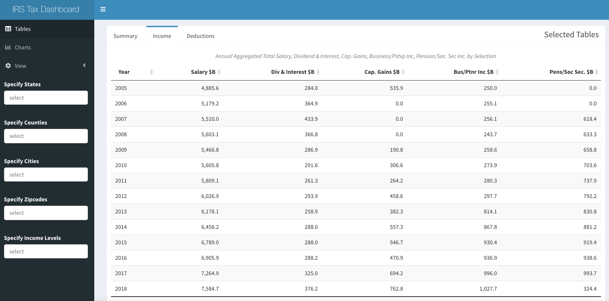
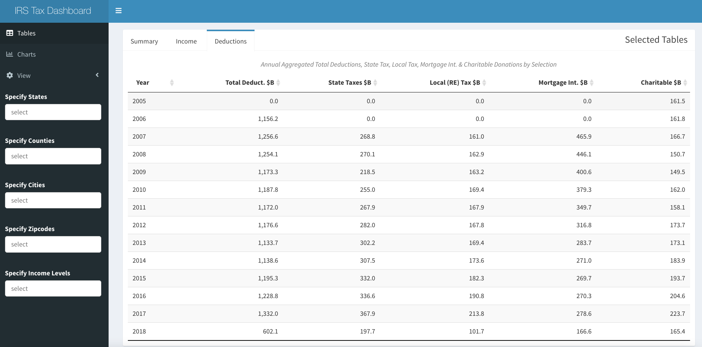

](https://luceyda.shinyapps.io/irs_dash/)

# Introduction {#introduction}

The [IRS SOI Tax Statistics](https://www.irs.gov/statistics/soi-tax-stats-individual-income-tax-statistics-zip-code-data-soi) is a fabulous seemingly undiscovered data set, which should be frequently referenced in any discussion about income and taxes. We often see median income represented by Census data, but have always been skeptical that most people know their exact income in any given year or would report it according to a uniform definition if asked by a census taker. This data set aggregates elements of all 1040 filings by zip code across six income levels, with Adjusted Gross Income (AGI), sources of income, credits and deductions with both amounts and counts. It seems to reflect a much more robust measure of earnings, although a slightly less granular format than the census tracts. As is typical in almost every open public data we have worked with, formats, variables and groupings change from year to year, so accessing a clean long-term time series was a painful proposition.

We first introduced the IRS SOI Tax Statistics as a thematic data set for Redwall in [Analysis of Connecticut Tax Load by Income Bracket](https://redwallanalytics.com/2019/01/09/analysis-of-connecticut-tax-load-by-income-bracket/). In that post, we discussed the data and methodology used to collect and clean it in. Then, we used it in more detail in [IRS Data Shows Growth in Number not Income of Highest Earners since 2005](https://redwallanalytics.com/2019/03/07/irs-data-shows-connecticut-taxpayers-also-pay-higher-federal-taxes/). Finally, [IRS Data shows Connecticut Taxpayers Also Pay Higher Federal Taxes](https://redwallanalytics.com/2019/03/07/irs-data-shows-connecticut-taxpayers-also-pay-higher-federal-taxes/) compared the federal tax rates payed by CT residents to national averages. All three of these previous posts were before we had the disclosure for 2018, one of the more interesting tax years because of the Trump tax cut and its controversial SALT limitations.

When we worked on those posts, we also did not have the skill we have now have to make a Shiny dashboard, unlocking this valuable data for anyone wishing to explore it. In this post, our we discuss our new `{irs.soi}` package (available on Github, not CRAN), describe the methodology we created to download, clean and prepare the data for exploration in a new Shiny `{golem}` app.

# Methodology {#methodology}

One of our themes in recent months has been re-factoring the messy code and work flows, that we built up while learning over these last few years. Like many, our IRS explorations had become a mess and certainly not accessible to anyone else, so moving all of our functions into a package structure was overdue. Hence, we built the [{irs.soi}](https://github.com/luceydav/irs.soi) package, now hosted on Github. We found the NBER's Public Use Data Archive cleaned up version easier to use than the daunting collection of .csv's on the IRS website, so the package downloads specified years from the [Individual Income Tax Statistics - ZIP Code Data (SOI)](https://www.nber.org/research/data/individual-income-tax-statistics-zip-code-data-soi%3E) to a specified local folder. Please note that our app data includes 2017-2018, previously included on the NBER site, but now removed. Using `{irs.soi}`, specifying a path and running `download_nber_data()` will download the data to a local folder (or put it in a `data/` file if none is specified). Please note that the full data set is over 3GB and should take at least 15 minutes to download.

Again using the `{irs.soi}`, the `load_soi()` function can be used to load and compile the data into a data.table, and `clean_soi()` cleans according to our process. One place we had to manually intervene was to aggregate income levels, because the IRS had changed size bands in 2007. We did this in a way which maintained the integrity of the bands (ie: \<\$10k and \<\$25k became one band and \>\$100k and \>\$250k another), but at the expense of interesting granularity. Over the last 10 years, \>\$250k has been generally been defined as "rich", but our highest bands starts well below that. There were also some cases in 2006 where the data had bad classifications, but we were able to impute, and 2007-2008 strangely did not round by 1,000 as the other years did. Our `prepare_app_data()` filters sparse zip codes, and merges by zip code to add County and City filters, and can be used to ready for it to be run locally in Shiny using our `irsApp()` function.

# Data Summary {#data-summary}

To give a quick summary of the raw data and our preparations. There are almost 42,000 unique zip codes in the US, but many of these are P.O. Boxes with few or no people, and others are suppressed from disclosure if they don't have many taxpayers in a given period. We also further screened in `{irs.soi}` for only zip codes where all income levels were included for every year of our specified data, which gave us a total of 24,143. The IRS data is only disclosed by zip code and state, but we added County and Post Office City fields by joining with the zip code database in `{zipcodeR}`. The IRS removes zip codes below a threshold of filers for privacy reasons, and our package drops all zip codes which are not present in all years of the data set, which cost between \$100-150 billion of annual income in most years, but our final data is still close the full amount of returns, income and tax paid as reported by the [Tax Foundation](https://taxfoundation.org/summary-of-the-latest-federal-income-tax-data-2020-update/). The Tax Foundation reported total US taxpayers of 143.3 million, earnings of \$10.9 trillion and taxes of \$1.6 trillion in 2017, so the app pretty much matches these numbers in aggregate, but offers the opportunity to drill down by state, county, city and zip code, to see income, deductions and taxes broken out by major sources, as well as seeing an additional 13 years of data. Perhaps the most interesting aspect of the data in the app is that it includes 2018, the first year including the Tax Cuts and Jobs Act of 2017.

# Conditional Drop Down Filtering {#conditional-drop-down-filtering}

This is not a code-based post, but just a word about the filtering of locations, which is now excellent. The app has a nested geographical structure. We wanted users to be able to find their chosen geography with as little struggle, waiting time and server usage as possible. We tried several ways of doing this efficiently, but it was difficult. In Hadley Wickham's new book section, [Mastering Shiny: 10.1.2 Hierarchical Select Boxes](https://mastering-shiny.org/action-dynamic.html?q=nested#hierarchical-select) proposed a sequence of nested `observeEvent()` and `updateSelectInput()` operations to filter a reactive data.frame inside the server function. We also looked at doing this on the server side with `updateSelectizeInput`, but with the size of our data or inexperience, it was very slow and usually ran out of memory. For others looking to accomplish a similar task, please see [our code](https://github.com/luceydav/irs.soi/blob/main/R/irsApp.R) using `shinyWidgets` and its `selectizeGroupUI` and `selectizeGroupServer`. This solution may be widely known to Shiny experts, but little has been written about it. The credit for helping us goes fully to David Solito for [Filtering a data frame with dependent drop down lists in Shiny thanks to Magrittr (aka conditional drop down list).](https://www.davidsolito.com/post/conditional-drop-down-in-shiny/). This was an excellent summary of a complicated task, which seems to be by far the best solution for this seemingly common task.

# Using the Shiny App {#using-the-shiny-app}

We were going to include the app in this blog post, but it is large and may take a little time to load, so please read the post and then follow the links to explore. When the app launches, it displays the aggregate AGI, tax paid, returns and unique zips for all of the data, included on the "Summary" table tab as shown at the beginning of the post. Choosing the "Income" tab, key component income sources, such as Salary, Dividends & Interest, Capital Gains, Business and Partnership Income and Pension & Social Security Income are displayed, can be explored over time.

By choosing the "Deductions tab, Total, State Taxes, Local Tax, Mortgage and Charitable Deductions in aggregate over time is displayed.

Using the three horizontal line icon at the top left, it is possible to access other tabs and filters. There is a second tab called "Charts" to see a plots of the change in AGI and tax rates over time. It is possible to see Aggregate or Per Capita by selecting with the "View" switch. The second tab also includes the "Compare" tab displaying the evolution of every state over time. Exact amounts or counts can be viewed by hovering with the tooltips.

As mentioned above, it is possible to filter all of these tables and charts by State, Counties, Cities or all the way down to individual or groups of zip codes using the black tab on the left. There is also the option to select income bands (\$\<25k, \$25-50k, \$50-75, \$75-100k and \$\\100+). We would have liked to show more granularity above \$100k, but that would have meant showing a shorter time period. Given the richness of this data set and the incredible functionality of Shiny and the flexibility of `{golem}`, we hope to add many more avenues of exploration in the future.

# Assessing the App {#assessing-the-app}

At about 110MB and almost 1.7 million rows, this app is large, and may have a broader audience than some of our previous ones ([Connecticut Property Selling Prices vs Assessment Values over Three Revaluation Cycles](https://luceyda.shinyapps.io/ct_real_assess/) and [Risk Score History of Selected CT Town](https://luceyda.shinyapps.io/yankee_shiny/), so we are not sure how long our server time on Shinyapps.io will last at our account level and advise patience if it takes a moment to load. We intend to add more fields and visual analyses, and to expand the functionality, so have to explore the options for cost effective hosting, since this is personal project. If the app runs out of server time, there is always the option to use `{irs.soi}` to download the and clean the data, and then run the app locally with `{irsApp}` (as described above).

# Observations {#observations}

We observe that income of lowest income group viewed on national level has increased average AGI by about 20% since 2005, and there are significantly fewer filers in that group over the period. Average income levels of the three middle bands are so flat in nominal terms over the period that it is almost hard to believe. There were increases in the number of tax payers in all of the middle groups, but not even close to increase in number of taxpayers in the highest income group, which more than doubled over the period to 28.6 million returns (out of 146 million filed in 2018). Unlike the other groups, the average income of the highest group declined considerably during the Great Recession, but has more recently recovered to be slightly higher than the previous peak. In real terms, a significant loss of purchasing power on average in all groups over the period is evident. If greater granularity in the highest group were possible, it might show the much discussed gains made by the top 0.1%.

In aggregate, total deductions fell from \$1.3 trillion to \$600 billion between 2017 and 2018, with big declines in state, local, mortgage and charitable deductions. We will leave it to explorers to find out which geographies suffered the most by exploring using the filters. in spite of the lost deductions, the effects of the recent tax cuts can be seen in all income bands having lower Federal tax rates in 2018, and even the highest bands of most blue states show lower tax rates despite SALT restrictions. The highest income bands did indeed see a reduction in percentage of total tax paid during 2018, to 79.5% from 81.7%, though in our bands, this includes incomes could be considered middle income in high cost areas.

# Conclusion

We have probably reached the size we can with our current shinyapps.io infrastructure. We plan to add more visualizations and tables with the existing data, but would also like to add additional variables from other sources, such as real estate prices, transportation or education data in the future. In order to do this, we will need to learn a considerable amount about how to deploy on Shiny Server or create our own server on AWS in a Docker container. The code to download the IRS SOI data and the app are available on Github for others to try. We would welcome other partners, contributors or just feedback to improve the app in the future.
