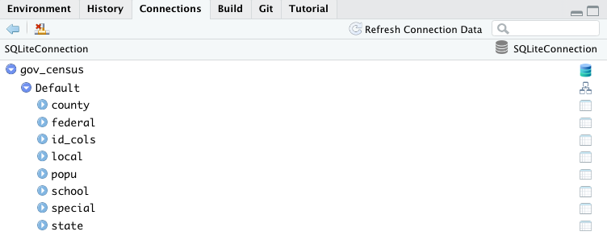

```{r 'set-up', message=FALSE, warning=FALSE, include=FALSE}
# Libraries
if(!require("pacman")) {
  install.packages("pacman")
}

pacman::p_load(
  dplyr,
  tidyr,
  scales,
  DBI,
  glue,
  RSQLite,
  ggplot2,
  plotly)

knitr::opts_chunk$set(
  comment = NA,
  fig.width = 12,
  fig.height = 8,
  out.width = '100%'
)
```



# Introduction

We have been exploring Willamette University [Government Finance Database](https://willamette.edu/mba/research-impact/public-datasets/index.html), a cleaned up and aggregated version of 50 years of annual Census of Governments. For those interested in learning more, please see Willamette's paper [The Government Finance Database: A Common Resource for Quantitative Research in Public Financial Analysis](https://willamette.edu/mba/research-impact/public-datasets/index.html) describing the database and its creation. It is an amazing resource of 2.4 GB in .csv form, but with over 500 fields of financial statement items in nested levels of government entities, is very complicated even after the extensive work Willamette have done to compile it. This is exactly the kind of less well known, but valuable longitudinal data, for which we have had the most interest. Our recent [Introducing the Redwall IRS SOI Tax Dashboard](https://redwallanalytics.com/2021/02/03/introducing-the-redwall-irs-soi-tax-dashboard/) describes our similar project with 15 years of detailed IRS tax data by zip code, and related new package `{irsSOI}` and {golem} Shiny app `{irsApp}`. We dug a bit into SQL in [Learning SQL and Exploring XBRL with secdatabase.com - Part 1](https://redwallanalytics.com/2020/09/10/learning-sql-and-exploring-xbrl-with-secdatabase-com-part-1/), but it took a long time to generate queries we felt confident in. In this post, we will describe how we can use the amazing `{dplyr}` SQL translation layer as a tool to quickly develop and explore with elaborate queries. This may also help us to find a durable solution of a back-end for our projects and apps with `{SQLite}` databases.

# Where This is Going

When we began, it was fine to load a .csv file into memory, but as our projects, size of data have grown, and most urgently, the need for responsive apps backed by larger amounts of data, a strategy to use remote relational databases has become more pressing. We looked at solving this problem with [Tapping Yelp data with Apache Drill from Mac using {sergeant}](https://redwallanalytics.com/2020/10/27/tapping-yelp-data-with-apache-drill-from-mac-using-sergeant/), but Drill was complicated to install, and ultimately couldn't get it to work as hoped. With `{SQLite}` widely available and built into our local system, ready to store and fast retrieval from an RStudio connection with a simple line of `{dplyr}` code seems like a winner. Our ultimate goal find the right back-end for larger data, allowing fast, easy filtering and aggregations across many categories in Shiny apps. When we built the trial version of [IRS Tax Dashboard](https://luceyda.shinyapps.io/irs_dash/), we found that the app was very responsive despite having tens of thousands of nested filtering options backed by a .fst file, but could only host a fraction of fields that we hoped to include on our introductory Shinyapps.io account. We now have an much reworked `{golem}` version ready to go with many more fields and viewing modules, but at 300MB+ of data, it is too big to deploy through that channel. With the `{SQLite}` solution, all that remains would remain is to set up to access the database from an AWS in a docker container.

# The Willamette Government Finance Database and `{govFin}` Package

For this project, we built [`{govFin}`](https://github.com/luceydav/govFin) to download and convert the Government Finance Database's aggregated .csv into a `{SQLite}` database all with one function shown in the code chunk below. The downloaded zip file is 292 MB, but expands to into a 2.4 GB csv, before fitting in a 1.1 GB database. With separate tables for each type of government entity (federal, county, state, local, school districts and special districts). Response to queries lagged a bit until we added the Census identifier ("id") as index for all the tables. After that, responses to joins and aggregations were instantaneous. We have set up separate tables for the identifier and population counts also indexed by "id".

Within tables, there is still a lot of complexity, flattened with detail and summary rows included side-by-side for balance sheet, income and cash flow items. There are also two separate surveys, the full census every five years and annual surveys which have a lot fewer responses and are biased to larger municipalities. For those wanting to replicate some of the strategies in this post or to access the data, please install our `{govFin}` package from Github. Running `govFin::full_gov_census_db_wrapper()` with the desired local path will download the full Willamette data set and build a `{SQLite}` database leaving behind only the original zipped folder.

```{r wrapper, echo=TRUE, message=FALSE, warning=FALSE, eval=FALSE}
# Not run here
# install.packages("devtools")
devtools::install_github("luceydav/govFin")

# Download zip and create SQLite database at path
path <- "/Users/davidlucey/Desktop/David/Projects/govFin/inst/extdata/"
govFin::full_gov_census_db_wrapper(path = path)
```

# The `{SQLite}` Database

Once built, the database can be easily accessed from RStudio with the DBI package, but unfortunately a SQLite connection in memory can't be viewed in the Connections pane. It possible to use Connections (pictured at the beginning of this post) by using `connections::connections_open()` instead of `DBI::dbConnect()`. However, `{connections}` didn't allow us to interact with the database using DBI functions like `DBI::dbListTables()` or `DBI::dbListFields()`, so we went with `{DBI}`, because we are going to use the `{dplyr}` `tbl()` function to create a table object in the Global Environment and to interact with tables anyhow.

```{r 'connection', echo=TRUE, message=FALSE, warning=FALSE}
# Set up connection with DBI package
gov_census <- 
  "/Users/davidlucey/Desktop/David/Projects/govFin/inst/extdata/gov_census.db"
conn <-
  DBI::dbConnect(RSQLite::SQLite(), dbname = gov_census)

# Alternative to use RStudio connections pane
# conn <-
#   connections::connection_open(RSQLite::SQLite(), dbname = gov_census)
```

As shown in the code chunk below, there are 526 fields in our local table, and when considering that it is relatively consistent over so many entities and years, is a impressive resource and surprisingly little cited and discussed.

<details><summary>Click to see code generating output</summary>
```{r 'fields-data', echo=TRUE, message=FALSE, warning=FALSE, paged.print=TRUE}
d <- DT::datatable(
  data.frame(
    fields = DBI::dbListFields(conn, "local")[1:175], 
    fields2 = DBI::dbListFields(conn, "local")[176:350],
    fields3 = DBI::dbListFields(conn, "local")[351:525]), 
  rownames = FALSE
)
```
</details>

```{r 'fields-dt', echo=FALSE, message=FALSE, warning=FALSE}
d
```

There are large number of financial variables spread across a many tables, and also some identifying data stored in "id_cols" and time-related demographic data in "popu". In order to aggregate values per population by state or local entities, complicated `{SQL}` queries involving five separate tables ("state", "county", "local", "school" and "special") are required. We would also need to separately link our id and demographic data which are also in separate tables. This post will show how easy this can be using a familiar `{dplyr}` environment. 

```{r 'assign-tbl', echo=TRUE, message=FALSE, warning=FALSE}
# Assign tables to dplyr SQL connections using tbl()
tables <- DBI::dbListTables(conn)
for (table in tables) {
  assign(table, tbl(conn, table))
}
```

# Squaring Up Population Data Across Governments

With the code in the chunk above, we set up a SQLite Connection object in our RStudio Global Environment pane to represent each table in the database like any other data.frame. The key difference is that the data in a connection object is a "lazy query" displayed in 1,000 row samples and is not brought into our local environment until we `collect()` it. Because of this feature, we can perform our joins and aggregations with other objects within the database, and only bring back the needed data into our environment. This enables us to explore without the memory constraints we have sometimes experienced even at this size of data, and also to experiment with generating complicated `{SQL}` queries.

```{r 'local', echo=TRUE, message=FALSE, warning=FALSE}
head(select(local, 1:10), 5)
```

In order to look at per capita statistics without double counting, we would like to check if the data duplicates population counts across tables in the various government entities. In the query below, we remove the Federal Government rows from our id_cols table, because those only go up until 1995, leaving all other government entities. In the output below, the aggregated population counts look about right at the state level (state code = 0), but it might also be interesting to check if the town-by-town aggregations add up to the state totals.

<details><summary>Click to see code generating output</summary>
```{r 'state-level', echo=TRUE, message=FALSE, warning=FALSE}
state_level <- 
  id_cols %>%
  filter(type_code == 0) %>%
  left_join(popu, by = "id") %>%
  filter(year4 == 2016) %>%
  group_by(state_code, year4) %>%
  summarize(
    name, 
    tot_state = sum(population, na.rm = TRUE),
    .groups = "drop") %>% 
  select(name, state_code, tot_state) 
```
</details>

```{r echo=FALSE, message=FALSE, warning=FALSE}
head(state_level, 7)
```

In the code below, we add up any populations tied to the County, Municipal, Township and other districts (type_code from 1-5). We live in Connecticut which doesn't have county governments, but other states may have different structures, so we need to look across county, municipality, townships, school and special districts, so we are talking about a pretty complicated query including joins, filtering, pivots and aggregation. Now we can see that this is getting into some really complicated `{SQL}` for a guy who doesn't know `{SQL}`. We haven't added the state name yet, but the aggregations by state_code of the local totals are shown below.

<details><summary>Click to see code generating output</summary>
```{r 'local-level', echo=TRUE, message=FALSE, warning=FALSE}
local_level <-
  id_cols %>%
  filter(type_code %in% c(1:5)) %>%
  select(id, state_code, state_code, type_code) %>% 
  left_join(popu) %>%
  filter(year4 == 2016) %>%
  select(state_code, type_code, population) %>% 
  pivot_wider(
    names_from = type_code,
    values_from = population,
    values_fill = 0,
    values_fn = sum
  ) %>% 
  rename(
    state_code = 1 ,
    county = 2,
    munis = 3,
    school = 4,
    special = 5,
    townships = 6) %>% 
  select(state_code, county, munis, townships, school, special) %>%
  mutate(tot_local = county + munis + townships + school + special)
```
</details>

```{r echo=FALSE, message=FALSE, warning=FALSE}
local_level
```

Adding the state name and joining the state_level and local_level tables, the summary table below compares the state populations with the aggregate local counts. The total population at the state level is generally in the range, but often considerably lower than "state" totals. It looks like we will have to aggregate up to the state level in order to calculate any per population amounts and not rely on the local totals.

<details><summary>Click to see code generating output</summary>
```{r 'popu-comp', echo=TRUE, message=FALSE, warning=FALSE}
# Save query
pop_comp <-
  state_level %>%
  left_join(local_level, by = "state_code") %>%
  select(name, county, munis, townships, tot_local, tot_state) %>%
  mutate(percent_diff = tot_local/tot_state - 1)

# Collect query for display locally 
population_DT <- 
  pop_comp %>% 
  collect %>%
  mutate_at(vars(county:tot_state), function(x) x/1000)
```
</details>

```{r 'popu-comp-DT', echo=FALSE, message=FALSE, warning=FALSE, fig.cap='Population Data from Local Tables vs State Aggregates (Thousands)'}
DT::datatable(
  population_DT,
  colnames = c(
    "State",
    "County",
    "Municipality",
    "Township",
    "Local Total",
    "State Total",
    "Percent Diff"
  ),
  rownames = FALSE
) %>%
  DT::formatRound(
    2:6,
    digits = 0,
    mark = ",") %>% 
  DT::formatPercentage(
    columns = 7,
    digits = 0)
```

A shown in in the code chunk below, this is a complicated query for a relatively novice `{SQL}` and infrequent `{dplyr}` user, but was easily put together in a couple of hours. It was also easier to experiment and seemed less likely that we would make an error than if working in `{SQL}`. Though it may not be fully optimized, it seems like it could take a long time to learn SQL at that level. The `{dbplyr}` package has the `sql_optimise()` function, but it didn't change our query at all. It will be interesting to see if tools develop to help users further optimize queries. As habitual `{data.table}` users, a similar translation layer would also be a big help.

```{r 'show-query', echo=TRUE, message=FALSE, warning=FALSE}
# View SQL query
show_query(pop_comp)
```


# Aggregating All Income and Spending by Population

To take it to another level, now we can get back to the original challenge:  calculating the state total income and spending per population by all forms of government. In order to do this, we have to merge the 5 non-federal government tables together, aggregate the selected items, join on the identifier and population tables and filter for only full census years (ending in 2 or 7). We also then calculate the per population amounts for and tidy up our three selected variables, which just about doubles the query size.

<details><summary>Click to see code generating output</summary>
```{r}
# State population and identifier SQL Connection object
state_pop <- popu %>%
  left_join(id_cols) %>%
  filter(type_code == 0) %>%
  select(state_code, year4, population, name)

# Fields to keep from tables
fields <-
  c("id",
    "total_revenue",
    "total_taxes",
    "total_expenditure",
    "year4")

# Years to keep
full_census <- seq(1972, 2017, 5)

# Union of tables 
all_govs <- 
  union_all(
    select(county, fields), 
    select(local, fields), 
    select(state, fields), 
    select(special, fields),
    select(school, fields)
    )

# Aggregations after merging tables
vars <- c("year4", "name", "rev_pop", "tax_pop", "spend_pop")

# Final SQL connection object
state_agg <- all_govs %>%
  left_join(select(id_cols, c("id", "state_code"))) %>%
  group_by(state_code, year4) %>%
  summarize_at(vars(total_revenue:total_expenditure), sum, na.rm = TRUE) %>%
  ungroup() %>%
  left_join(state_pop, by = c("state_code", "year4")) %>%
  mutate(
    rev_pop = total_revenue * 1000 / population,
    tax_pop = total_taxes * 1000 / population,
    spend_pop = total_expenditure * 1000 / population
  ) %>%
  select(any_of(vars)) %>%
  tidyr::pivot_longer(names_to = "variable",
                      cols = contains("pop")) %>%
  filter(year4 %in% full_census)
```
</details>

```{r}
# View SQL query
dplyr::show_query(state_agg)
```

When we run this query against the database, the response is pretty close to instantaneous, and we still haven't even taken the data into memory when we plot it below with ggplot. 

<details><summary>Click to see code generating output</summary>
```{r 'format-ggplot', echo=TRUE, message=FALSE, warning=FALSE}
# Prepare plot directly from our SQL Connection object
p <- ggplotly(
  state_agg %>%
    ggplot(aes(year4, 
               value, 
               group = name, 
               color = name)
           )+
    geom_line() +
    facet_wrap( ~variable) +
    scale_y_continuous(labels = scales::dollar,
                       trans = "log10") +
    theme_bw() +
    theme(legend.position = "none") +
    labs(
      title = "State Select Revenue and Spending Items - 1972-2017",
      x = "Year",
      y = "Amount per Population"
    )
)
```
</details>

```{r 'ggplot-state-agg', echo=FALSE, message=FALSE, warning=FALSE}
# Show ggplot
p
```


As a final step, we can add our two queries as "Views" in the database so that they are immediately available in the future.

<details><summary>Click to see code generating output</summary>
```{r 'run-sql', echo=TRUE, message=FALSE, warning=FALSE, eval=FALSE}
# SQL render 
q <- dbplyr::sql_render(pop_comp)
q1 <- dbplyr::sql_render(state_agg)

# Add SQL queries as views in database
view_pop_comp <- paste("CREATE VIEW pop_comp AS", q)
view_state_agg <- paste("CREATE VIEW state_agg AS", q1)
rs <- DBI::dbSendQuery(conn, view_pop_comp)
dbClearResult(rs)
rs <- DBI::dbSendQuery(conn, view_state_agg)
dbClearResult(rs)
```
</details>
```{r}
# Showing views now in database
DBI::dbListTables(conn)
```


# Conclusion

The need to know `{SQL}` in the data profession is widely agreed upon, but there is so much to learn. This post might show that spending some of that time getting really good at `{dplyr}` might offer 2 skills for the price of 1. Complicated joins, aggregations and indexing may not be beginner data manipulations, but given how easy this was at this stage, it might have been better if we had been nudged away from .csv's earlier. Now at a more advanced levels, the missing pieces we would like to see are mainly a translation layer to use `{data.table}` to interact with the connection object and also that the ability to use regular expressions with `{stringr}`, which don't seem to be implemented yet.
