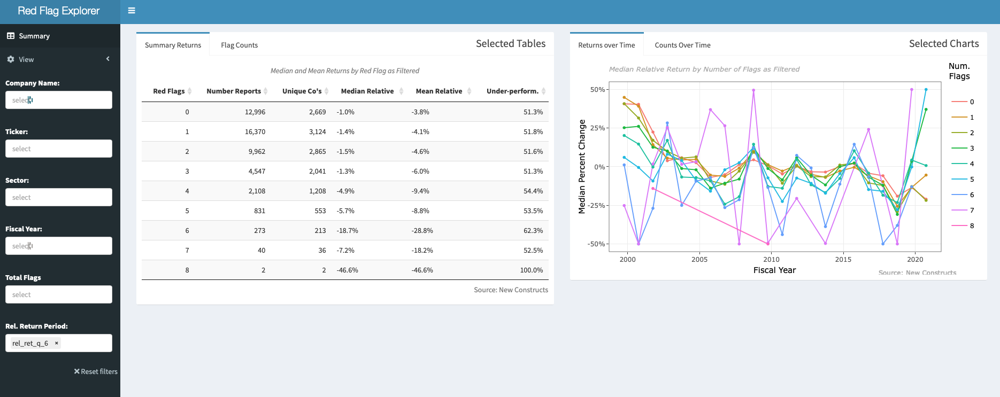

*NOTE: The read time for this post is overstated because of the formatting of the code. There are about 4,400 words, so read time should be closer to 15 minutes.*

[{width="12in" height="6in"}](https://luceyda.shinyapps.io/redflagapp/)

```{css include=FALSE}
.tab - content > .tab - pane {
  display:block
  height:0px
  overflow:hidden
  padding:0px
}
.tab - content > .active {
  display:block
  height:auto
  padding:12px
}
```

<details>

<summary> Click to see R set-up code </summary>

```{r 'set-up', echo=TRUE, message=FALSE, warning=FALSE}
# Libraries
if(!require("pacman")) {
  install.packages("pacman")
}
pacman::p_load(
  data.table,
  scales,
  ggplot2,
  plotly, 
  DT)

# Set knitr params
knitr::opts_chunk$set(
  comment = NA,
  fig.width = 12,
  fig.height = 8,
  out.width = '100%'
)

# Load annual data only
path <- 
  "~/Desktop/David/Projects/new_constructs_targets/_targets/objects/"
red_flags <- 
  readRDS(paste0(path, "nc_annual_red_flags"))
annual_data <- 
  readRDS(paste0(path, "nc_annual_final"))
```

</details>

# Key Findings {#key_findings}

-   1999-2000 was an exceptional period for both "Red Flag" prevalence and return differentiation, though apparent benefits of the strategy appear in most periods.
-   Approximately 2.5% of filings we checked had 5 or more "Red Flags" among annual and quarterly filings, so sparsity is challenge in estimating true relative returns.
-   Finding price histories for de-listed companies in open source channels is an challenge, which likely creates "survivor bias" in relative return estimates.
-   Prevalence of accounting distortion declined considerably since 1999-2000.

# Introduction {#introduction}

A few months ago in [A Blueprint of "Red Flag" alerts Using Adjusted Earnings Data](https://redwallanalytics.com/2021/04/21/a-blueprint-of-red-flag-alerts-using-adjusted-earnings-data/), we mused about using [New Constructs](https://www.newconstructs.com) historical data to back-test ideas from a 2003 CFA Conference Proceedings article entitled [Revelations from Financial Reporting](https://www.researchgate.net/publication/247881344_Revelations_from_Financial_Reporting) by Bruce Gulliver. This article succinctly offered the theory that, in the aftermath of the collapse of "Dot-com Bubble", impending losses for many stocks might have been avoided by using a simple set of financial statement ratios, collectively as "red flags". Mr. Gulliver's work always stuck with us, and especially now that R can easily be used to test the hypothesis and to take the analysis to a different scale and interactivity. The only other missing piece would be thousands of companies with consistently and meticulously adjusted financial statement data over a very long period, which as far as we know, only resides at New Constructs.

After our blog post, New Constructs kindly offered to let us use their data to test the theory on a large sample of companies and over the last twenty years, which includes two of the great stock market busts and the recent Covid-19 related volatility. In this post, we will describe our analysis, summarize the benefits of the unparalleled New Constructs data and the interactive [Red Flag Explorer](https://luceyda.shinyapps.io/redflagapp/) Shiny app we have built for anyone who would like to interact with our derived "red flags" and measure their performance. Other than being the beneficiary of their generous support for our project, we do not have any business relationship with New Constructs.

It is striking that analysis on this scale (ie: analyzing \~125,000 unique financial statements), impossible for a regular person with a computer to produce (much less share with others) for most of our years following markets, can now be conducted in a few weeks of coding. We think our "red flags" built on top of New Construct's data represent a unique historical fingerprint of the market's reaction to accounting disclosures in the controversial post-2000 period.

# Red Flag Calculations {#red-flag-calculations}

The methodology for generating "red flags" was close to what we laid out in [A Blueprint of "Red Flag" alerts Using Adjusted Earnings Data](https://redwallanalytics.com/2021/04/21/a-blueprint-of-red-flag-alerts-using-adjusted-earnings-data/), but there were several differences.

-   We didn't fully understand the *Revelations* [cash flow]{.ul} adjustments, which primarily had to do with timing differences of expensing of employee share options. According th Mr. Gulliver's article, this became very significant during the Dot-com Bubble in many companies, but we are not sure if it is still so, and didn't have comparable data from New Constructs to calculate it. If we were to do it again, we would have requested the data to calculate the difference between New Constructs "True Free Cash Flow" and "Traditional Free Cash Flow", as laid out in [The Most Overstated And Understated FCF In The S&P 500 Post 1Q21 Earnings](https://www.forbes.com/sites/greatspeculations/2021/06/16/the-most-overstated-and-understated-fcf-in-the-sp-500-post-1q21-earnings/?sh=536bff042be2) by David Trainer (CEO of New Constructs) in the June 14th Forbes issue. For now, our app won't have a "red flag" pertaining to cash flow.

-   [Asset turnover]{.ul} was calibrated relative to other companies in the same sector, but considering the full 20+ year period when determining unfavorable ratios.

-   Trend-related variables (ie: increasing days of inventory/receivables, declining margins and ROIC and declining reserves/sales ratios) were calculated by taking more than one year of change into account to give an added penalty when the negative trend was persistent. This had a cost of losing the two periods at the very beginning of the series (ie: 1997-1998), because those were needed for the look-back.

-   The [High Valuation]{.ul} "red flag" was calculated using New Construct's three valuation-based Stock ratings (FCF Yield, Price-to-Economic Book Value and Market Implied Growth Appreciation Period), themselves derived variables, rather than raw valuation metrics. New Constructs does not use the traditional GAAP earnings and book value ratios pointed to in *Revelations* to determine valuation, for reasons very well discussed in the [Basic Metrics](https://www.newconstructs.com/education/basic-metrics/) section on New Construct's website.

-   We don't know what Mr. Gulliver would have used, but we defined "high" [Earnings Distortion]{.ul} as an equal aggregation of the highest divergence of NC adjusted from reported net earnings divided by market capitalization and the absolute value of reported net earnings.

-   For [liquidity]{.ul}, we first screened that a company did not have "excess cash", a New Constructs derived variable measuring the amount of cash over and above what was needed to conduct operations. If the company did not have "excess cash", we then used several credit metrics similar to those discussed in *Revelations*, but using the comparative New Construct's derived financial statement items.

-   We also added two additional "red flags" of our own, for companies having amended filings (by far the least common "red flag") and with more than two flags previously still showing filing-on-filing increases in total flags.

# Thoughts on Red Flags {#thoughts-on-red-flags}

We don't know what thresholds Mr. Gulliver would have used in his calculations, but where we had discretion, our "red flags" were calibrated to occur in about 20% of filings over the "whole period" (as shown in Figure \@ref(fig:red-flag-summary-chart) below). Because some flags were less frequent, the average rate of occurrence over all 10 flags was 13.8%. If the probability of raising flags was independent, this would translate into a 0.6% probability of having 5 or more flags (based on the binomial), but almost 2.5% of filings analyzed had that many flags, so this may be a sign that some flags contribute to the likelihood of others and may not be independent.

When we say "over the whole period" above, this is significant because it means that the cut-offs for a "red flag" is the same regardless of the reporting period. Another option would have been to calculate by period (ie: attributing a similar number of each red flag in each period), but that would have taken away the ability to compare behavior over time. There was no special knowledge consideration given to "informed" threshold levels, where evidence supported likely problems, just that the selected metric was deviating negatively relative to the large majority of filings during the 20-year period. Further work in this regard might even improve the quality of the signalling.

<details>

<summary> Click to see R plot code </summary>

```{r 'red-flag-summary-code', message=FALSE, warning=FALSE}

# Melt on logical cols as measure
cols <- names(red_flags)[sapply(red_flags, is.logical)]

# Melt data to long on fiscal_year and total_flags
red_flags_long <-
  red_flags[
    data.table::between(fiscal_year, 1999, 2020),
    lapply(.SD, mean),
    .SDcols = cols,
    fiscal_year][
    ][order(fiscal_year)][
    ][, data.table::melt(.SD, measure.vars = cols)]

# Make basic ggplot on x = fiscal_year and y = total_flags.
p <- 
  red_flags_long[, 
    ggplot2::ggplot(
      .SD,
      ggplot2::aes(x = fiscal_year,
                   y = value,
                   color = variable,
                   fill = variable)) +
      ggplot2::geom_line() +
      ggplot2::geom_point(size = 1) +
      ggplot2::labs(
        x = "Fiscal Year",
        y = "Percentage of Filings") +
      ggplot2::scale_y_continuous(
        labels = scales::percent) +
      ggplot2::theme_bw()]

# Render as plotly and add customized flag labels to plotly object
p <- plotly::plotly_build(p)

names <- c(
  "Amend.",
  "Low Return",
  "Earns. Distort.",
  "Reserve Decline",
  "Days Inv or A/R ",
  "Mgn & ROIC decline",
  "Asset Turns",
  "High Val'n",
  "Poor Liquid.",
  "Neg. Trend")

vars <-
  c(
    "amended",
    "agg_returns",
    "aggregate_distortion",
    "reserves_indicator",
    "bs_indicator",
    "margins",
    "turnover_flag",
    "agg_rating",
    "liquidity",
    "trend"
  )

# Add red flag labels and tooltip to Plotly object
for (i in 1:10) {
  p$x$data[[i]]$name <- names[i]
  
  d <- 
    red_flags_long[variable == vars[i]]
  
  p$x$data[[i]]$text <- paste(
    "Period: ",
    d$fiscal_year,
    "<br>",
    "Red Flag Indicator: ",
    names[i],
    "<br>",
    "Percent of Occurrences: ",
    paste0(round(d$value * 100, 0), "%"),
    "<br>"
  )
}
p[["x"]][["layout"]][["annotations"]][[1]][["text"]] <- "Red Flag"

# Add "Source: New Constructs" to bottom right
p <- 
  p %>% plotly::layout(
    hoverlabel = list(align = "left"),
    annotations =
      list(
        x = 1.05,
        y = -0.10,
        text = "Source: New Constructs",
        showarrow = F,
        xref = 'paper',
        yref = 'paper',
        xanchor = 'right',
        yanchor = 'auto',
        xshift = 0,
        yshift = 0,
        font = list(
          size = 12,
          color = "darkgray")
      )
)

```

</details>

```{r 'red-flag-summary-chart', echo=FALSE, out.height='100%', fig.cap='Prevalence of Most Red Flag Declined Since Early 2000s', message=FALSE, warning=FALSE}
p
```

# Ex-Post Return Data {#ex-post-return-data}

In order to calculate *ex post* quarterly returns, we tried to find matching weekly prices for every company in the New Constructs database using the R `{BatchGetSymbols}` package, a wrapper for `{quantmod}`, when more than a few hundred tickers are needed. Both packages source prices from Yahoo Finance by default, and provided price histories for almost 4,000 requested companies. About 1,700 tickers, generally defunct since the earlier periods of the series, were not available in Yahoo Finance, but we were able to recover an additional \~800 of the missing price histories using [Alpha Vantage](https://www.alphavantage.co) (the main pricing alternative to Yahoo Finance offered by `{quantmod}`), leaving \~900 companies unmatched.

While Yahoo maintains, and we used the "adjusted prices" (ie: for splits, dividends and other corporate actions) when available, Alpha Vantage only offered closing prices (un-adjusted). Although we assume that many of these must have gotten into difficulty and otherwise been de-listed, some might have been subsumed into other companies, possibly at a premium. If the stock price went to zero or was otherwise de-listed from trading, we think the fact that the price data was not adjusted might be less relevant, because it probably wasn't paying dividends, spinning off subsidiaries or successfully completing a rights offering. Still, the 800 companies currently using closing prices from Alpha Vantage may cause some inaccuracy in our return estimates.

When we matched companies with returns, we used a "rolling join" on ticker and date, taking the last weekly price [after]{.ul} to the filing date to simulate purchasing after the number of "red flags" was known. For this reason, the return calculated might start at the end of the same day as the report, or 1-4 days after the filing date. As a result, our relative return estimate should tend to be conservative approximation of the *ex-post* returns because it will not include the returns on the day of the report after the release (unless the report was after hours) and often not for several days after dissemination. When we calculated using the last weekly price [before]{.ul} the report date, the overall shape of the relative returns didn't look that much different (ie: higher "red flags" was associated with lower relative returns), especially when looking out several quarters.

<details>

<summary> Click to see R table code </summary>

```{r 'return-coverage-code', message=FALSE, warning=FALSE}

# Make datatable object
dt <-
  DT::datatable(
    annual_data[, {
      coverage = .N
      matched = .SD[!is.na(rel_ret_q_1), .N]
      percent_matched = matched / coverage
      list(coverage, matched, percent_matched)
    },
    fiscal_year][order(fiscal_year)], 
    rownames = FALSE,
    colnames =
      c("Fiscal Year",
        "New Constructs Coverage",
        "Matched with Returns",
        "Percent Matched"),
    options =
      list(pageLength = 24,
           scrollY = "400px",
           dom = 't')) %>%
  DT::formatPercentage(
    columns = 4,
    digits = 1) %>%
  DT::formatRound(
    columns = c(2:3),
    mark = ",",
    digits = 0)
```

</details>

```{r 'return-coverage-table', echo=FALSE, fig.cap='Rate of New Constructs Covered Companies Matched with Returns Lower in Earlier Period', message=FALSE, warning=FALSE}
dt
```

Figure \@ref(fig:return-coverage-table) above shows the percentage of companies matched with returns over time, similar to Figure \@ref(fig:red-flag-summary-chart) earlier. We were able to download and match returns for between 75-80% of the stocks covered by New Constructs in the earlier periods, and a much higher rate in the later years. In the end, we have return data to go along with filings for almost 5,000 distinct companies, but were unable to match approximately 8,400 of the 67,000 annual reports for 913 companies. While we do have all the needed return data for many 2020 filings, the absolute number is lower because of the need to look ahead to calculate returns. We had significantly greater success matching quarterly reports, because those only started in a later period (around 2012 when New Constructs began providing them) when we had more complete pricing data.

<details>

<summary> Click to see R plot code </summary>

```{r 'summary-return-code', message=FALSE, warning=FALSE}

# Select cols with relative return data
cols <- 
    names(annual_data)[re2::re2_detect(names(annual_data), "rel_ret")]

# Melt on relative return amount columns
annual_data_long <-
  annual_data[, data.table::melt(
    .SD,
    measure.vars = cols,
    value.name = "rel_ret_amt",
    variable.name = "rel_ret_pd",
    na.rm = TRUE,
    variable.factor = FALSE,
    value.factor = FALSE
  )]

# Make ggplot using only 6 quarter subsequent returns and calculate median 
# by red flag
p <- annual_data_long[
  data.table::between(fiscal_year, 1999, 2020) &
    rel_ret_pd == "rel_ret_q_6",
  .(
    cases = .N,
    unique_companies = length(unique(ticker)),
    median_rel_return = sapply(.SD, median, na.rm = TRUE),
    mean_rel_return = sapply(.SD, mean, na.rm = TRUE)
  ),
  .SDcols = "rel_ret_amt",
  .(fiscal_year, total_flags)][, 
  ][, median_rel_return :=
        data.table::fifelse(
          median_rel_return < -0.5, -0.5, median_rel_return)][
  ][, median_rel_return :=
      data.table::fifelse(
        median_rel_return > 0.5, 0.5, median_rel_return)][
  ][,
    ggplot2::ggplot(
      .SD,
      ggplot2::aes(
        x = fiscal_year,
        y = median_rel_return,
        group = factor(total_flags),
        color = factor(total_flags),
        text = paste0(
          "</br>Reporting Period: ",
          fiscal_year,
          "</br>Total Flags: ",
          format(total_flags, big.mark = ","),
          "</br>Unique Companies: ",
          format(unique_companies, big.mark = ","),
          "</br>Cases: ",
          format(cases, big.mark = ","),
          "</br>Median Relative: ",
          scales::percent(median_rel_return, accuracy = 0.1),
          "</br>Mean Relative: ",
          scales::percent(mean_rel_return, accuracy = 0.1)
        )
      )
    ) +
      ggplot2::geom_line() +
      ggplot2::geom_point(size = 1)+
      ggplot2::scale_x_continuous(
        "Fiscal Year", 
        breaks = seq(2000, 2020, 5)) +
      ggplot2::scale_y_continuous(
        "Median Percent Change", 
        labels = scales::percent) +
      # ggplot2::scale_color_manual(labels = as.character(c(1:9)), values = c(1:9)) +
      ggplot2::labs(
        title = "",
        color = 'Num.\nFlags',
        caption = "Source: New Constructs") +
      ggplot2::theme_bw() +
      ggplot2::theme(
        plot.title = ggplot2::element_text(
          size = 10,
          face = "italic",
          color = "darkgray")
        )]

# Render as plotly with tooltips set in ggplot object
p <- 
  plotly::ggplotly(p, tooltip = c("text")) %>% 
  plotly::layout(
    hoverlabel = list(align = "left"),
    annotations =
      list(
        x = 1.05,
        y = -0.10,
        text = "Source: New Constructs",
        showarrow = F,
        xref = 'paper',
        yref = 'paper',
        xanchor = 'right',
        yanchor = 'auto',
        xshift = 0,
        yshift = 0,
        font = list(
          size = 12,
          color = "darkgray")
      )
  )
```

</details>

```{r 'summary-return-chart', echo=FALSE, message=FALSE, warning=FALSE, out.height='100%', fig.cap='Earliest Period Had Most Red Flags and Differentiation among Performances by Red Flag'}
p
```

Figure \@ref(fig:summary-return-chart) above shows the median returns for all companies over the subsequent 6 quarters (after reporting their 10-K filing). Using the tooltip, it is possible to see the number of companies, reports and flags during the selected period on the line chart. Note that we truncated the cases where the median return was worse than -50% in order to keep the scaling of the chart. There are usually only a few companies in these cases, but look at the "Mean Relative Return" in the tooltip these cases to get a better idea of the true number. The graphic shown here is static and only shows annual reports, but we will discuss how to change the parameters of the inputs using our interactive [Red Flag Explorer](https://luceyda.shinyapps.io/redflagapp/) Shiny app further down. In the next section, we will also discuss some of the ways that this picture probably understates the true differences in the relative performance of the "red flag" groups shown in the chart.

# Bias From Missing Return Data {#bias-from-missing-return-data}

All in all, we collected almost 4 million weekly prices for 5,000 unique companies, and calculated the comparative log returns relative to the Vanguard Total Market Index fund ("TMI") over the subsequent 1 through 13 quarters after every filing date. As shown in Figure \@ref(fig:return-coverage-table) above, we were able to match several thousand stocks covered by New Constructs in most years. We expect that across all the periods and companies, the aggregated relative returns by "red flag" group (as shown in the "Summary Returns" table and "Returns over Time" chart on [Red Flag Explorer](https://luceyda.shinyapps.io/redflagapp/)), should be representative, though not precise, picture of the true returns for companies with those attributes. The bands for higher "red flag" groups will always have greater uncertainty, because there are a lot fewer companies as the number of flags increase.

The group of companies unmatched to returns is especially unfortunate, because, as shown in Figure \@ref(fig:red-flag-summary-chart), aggressive accounting and other risky behaviors appear to have been most common between 2000-2005, and a much larger number of reports had to be amended. Briefly in 1999-2000, earnings distortion occurred in over 30% of companies. It is likely that companies which went out of business (ceasing to generate pricing data), also would have had more warning signs, and thus, have been most relevant to our analysis. In fact, in a list of 38 the most notorious accounting- and/or fraud-related scandals we could think of (ie: Enron, Worldcom, etc.), our pricing sources were missing for 10, a much higher rate missing than the overall average. To further confirm this expectation, the average number of "red flags" in unmatched companies in the annual data and quarterly data was 1.7 and 1.5, respectively, compared to 1.4 and 1.2 in the matched group. As a result, we expect "survivor bias" to make our estimated returns for higher "red flag" groups somewhat less bad than they otherwise would have been.

# Using the Shiny App {#using-the-shiny-app}

The triple horizontal line icon at the top left of [Red Flag Explorer](https://luceyda.shinyapps.io/redflagapp/), opens a menu which allows the user to change any of the input fields. Changing inputs alters the data viewed for all of the tables and charts displayed when the app loads. The "View" switch allows to toggle between 67,000 annual and 78,500 quarterly filings. All annual filings are included as the fourth quarter in the quarterly data set, so remember that about 20,000 filings are used in both the series. It should also be noted that the same flag on the same filing, for a company and period, might differ between our annual and quarterly calculations. This is because flags are calculated with reference to the other filings of the same group (ie: annual or quarterly). It is possible to filter by sector or by selecting a customized group of companies.

When the app loads, it reflects the aggregate of all 13 quarterly relative return periods, but most of these periods encompass each other (ie: the one quarter return is part of the two quarter return, etc.). We have observed that it isn't as easy to see the contrast of flag groups when the quarterly returns are only a quarter or two, so we recommend 4- or 6-quarters, but were unable to hard code this as a starting point into the app menu. The quarterly data set does not show returns beyond eight quarters, and though the annual data set shows up to 13 quarters, using this many will result in the loss of data in 2020 and 2021 (because we have to leave more lead time to calculate in those cases).

The "Returns over Time" tab shows the evolution of returns by number of red flags over time, similar to what we showed in the static Figure \@ref(fig:summary-return-chart) above. There are generally only a small number of companies in the groups with such large declines. It is also possible to choose a selection of companies, but "Returns over Time" for a group loses its meaning if there are too few items, because those companies are always changing. If the selection is small enough, there might not even be a single data point for a higher number of flags in a given year, and as a result, there may be an extended time difference between two points when there were no members of that group between those periods (usually more than five flags in a period).

The "Flags Counts" tab on the app shows the descriptions and counts of all "red flags" included in the filtered selection shown on the plots. As mentioned earlier, most individual flags occur in approximately 20% of the filings, so seeing more than a few flags for any given company during a period tends to be the small minority of filings. The number of unique companies included in the "red flag" group is a more important indicator than the number of reports shown in "Returns over Time". When looking at just one return period, this number should be pretty close to the number of reports unless an unusually long quarterly return period is selected.

Lastly, the "Counts over Time" tab shows the percentage of filings with that "red flag" during that period (as in the static Figure \@ref(fig:red-flag-summary-chart) earlier). Because "red flags" are calculated relative to the whole 20-year period, they are not evenly distributed by year to offer an objective perspective on how behavior in a given period and evolution over time. As discussed above, the early period in the chart has by far the most red flags, and in recent times, most groups haven't come close to matching those levels.

# Cursory Analysis {#cursory-analysis}

The beauty of our Shiny app is that we are able leave it for the user to explore the inputs and test sensitivity of "red flags" to performance for themselves. In aggregate, considering all periods, we observe that median group relative returns appear to be more stable and higher when the number of "red flags" is below 2-3, but generally seem to fall off proportionally as flags rise. There are naturally a lot fewer filings in higher flag groups, and as mentioned earlier, aggregate relative returns are much more uncertain and become considerably more volatile with a higher number of flags.

In the first few periods, most annual red flag groups outperform the TMI, but after 2003-04, almost all seem to under-perform, which we struggle to explain. This is even more so with the quarterly data, which starts later than the annual data. The TMI has a lot of stocks in it and should be less dominated by high market capitalization companies than the S&P 500. It also has a small management fee which our groups don't have. We would expect the stocks doing better and worse than the index in any period, to cancel each other out in aggregate. If anything, it seems like our process for collecting returns would be biased towards companies which did well (by surviving), so we would have expected our average returns to do better than the TMI if anything.

In the year 1999 (the beginning of our data) and for a few years after, there was a much more significant number of companies with 5-7 "red flags", and their under-performance was striking relative to the low flag groups. There are five years (2002, 2008, 2011, 2015 and 2020) where the differences among groups seems to contract, higher outperform lower red flag groups, and most groups outperform the TMI. These periods are all likely periods of changing expectations of Federal Reserve support for markets, and not surprisingly, this effect is by far the largest in the most recent intervention (during the 2020 Covid-19 period). Considering the whole period, it seems like the difference in median and mean relative returns between higher and lower flag groups seems to become smaller after 2005. We recall the post technology bubble period as being a golden age of stock picking. Certainly, when Mr. Gulliver wrote his *Revelations* in 2003, the case for indexing wasn't as strong as it has become since. Maybe more market observers took note than we might have thought and arbitraged some of these effects away.

The separation among groups by number of flags tends to be persistent for most sectors, though seems a little more contrast in cyclical sectors. This may be because the several of the cyclical "red flags" (such as Margins & ROIC and Days of Inventory & Receivables) affect those sectors more and may allow for greater contrast. Some "red flag" groups which were prominent early on, such as "Earnings Distortion" and "Amendments", mostly trended lower, while the prevalence of "Asset Turnover" warnings increased steadily over the period. Margins & ROIC declines rose sharply to above 30% during the 2008 and 2020 periods.

# Thoughts about Data and Modeling {#modeling-and-data-thoughts}

The model proposed by *Revelations* was rules-based, aggregating a large number of weak true/false (boolean) signals. It's power comes from simplifying and systematically taking more elements over a larger number of companies than most single analysts might consider at the same time. By collapsing the financial ratios down into boolean using arbitrarily thresholds, we lose a lot of data and are unable to allow variables to interact. We are also treating all of "red flags" equally, when some may be more important on their own or in combination with others. New Constructs was kind enough to share their data, but that was on a temporary basis, so this is beyond what we can achieve in this project, but taking these into account might give a even better signal of future performance.

In addition to the problem with sparsity among the higher flag groups, it isn't clear if the relationship between the number of flags and relative returns should be linear, and the few very filings with a high number of flags often seem to have had a more than a linear impact. The statistical modeling tools we have learned so far rely primarily on a few highly significant numeric variables, so we are not sure how to model when the signal derives from the sum of many weak true/false variables.

The nature of the data is also a consideration. We would like to measure the true difference in relative returns of an individual or collection of flags. The challenge is the longitudinal nature of the data, and the related sparsity of high flag data by period. This is a situation may be best addressed with a Bayesian mixed-effects model, which might allow us to get a more confident estimate for the return differentials of the sparse flag groups, by taking into account measurements from other periods to reduce uncertainty. This is something we may attempt in the future.

# Next Steps {#next-steps}

There are so many possible next steps it is difficult to know where to start. The first place would be to find the price histories for the missing 900 companies, preferably adjusted closing prices for comparability. It also might make sense to conduct as a genuine back-test of returns at different "red flag" levels, but we would need to re-format our rolling join to make the purchase after the report, and our data wouldn't allow for this consistently on the same date. We have included mainly accounting ratios in our analysis so far, but we could also easily add variables from other data sources, such as NLP signals like the sentiment of the MD&A, management incentive alignment measures, short interest ratios or insider selling. At the moment out of almost 145,000 filings, we found only about 2.5% with five or more "red flags" among the annual and quarterly data, so the contrast among groups might increase further if we to took into consideration more risk factors. With our code in an R `{targets}` project, any of these additions would only a short time to add to the app, so the whole project becomes a living document.

In our next blog post in this series, we plan to add a series of filters to the app of several themes including: notorious accounting collapses, meme stocks, high internally-generated intangible, companies which were present over the whole period and companies with high returns in spite of high red flags. We might also add some more visualizations to the app to enable users to explore these filters. Finally, we may attempt to build a Bayesian mixed-effects model in a future post as described above in order to better quantify if the differences and evolution in relative returns among groups we think we see in the "Returns over Time" plot are in fact real.

# Conclusion {#conclusion}

When we wrote [A Blueprint of "Red Flag" alerts Using Adjusted Earnings Data](https://redwallanalytics.com/2021/04/21/a-blueprint-of-red-flag-alerts-using-adjusted-earnings-data/), it felt like our goal was at the least a stretch. Thanks to the generosity of New Constructs and the powers of R, we have taken a long-held research question, and in our Shiny app, built a working prototype, which allows our findings to be shared with others and added to over time. The nature of the project is to see how effective the strategy is at filtering the small group of companies likely to have poor returns. Because of the sparsity of high "red flag" companies (which is by design), we struggle to know how to prove that the effects we think we see in the charts represent true differences in performance or are changing over time. Though we also cannot prove it, we suspect that the adjustments New Constructs has performed are likely a vital part of the model's ability to separate stocks into performance groups.

We plan to include the code for our calculations and Shiny app, and the derived "red flag" data on Github. [As a final note, we conducted most of our research on our own, and though we have been careful and re-checked many times, our code and calculations has not been reviewed by others. It is possible that there are errors in our analysis, and this work should not in any way be considered investment advice.]{.ul} Our work is only a back-test, so we encourage others to consider subscribing to New Constructs API and their real time data to mine for possible future accounting troubles.
