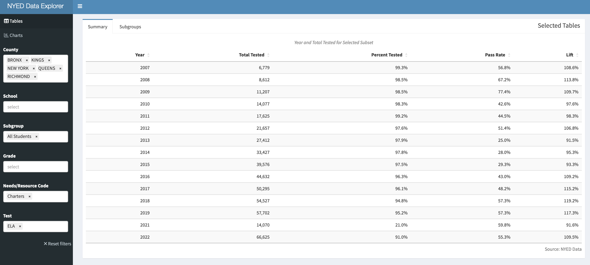

# Introduction

Three years ago, in the course of building personal projects in R using public data from Connecticut, I wrote [How Does Stamford Charter School for Excellence do it?](https://redwallanalytics.com/2019/11/02/how-does-stamford-charter-school-for-excellence-do-it/). "Stamford Excellence" was achieving remarkable results in a district with proficiency below 50%. Then and now, the school receives little recognition, and their effort to open a second Connecticut location in Norwalk, has been stymied as of this writing. My interest in these exceptional schools, and possibly the blog post, led to a new position as Director of Data & Research at another high-performing Bronx charter school network, [South Bronx Classical Charter Schools](https://classicalcharterschools.org). Naturally, when I discovered 15 years of [NYED assessment data](https://data.nysed.gov), the interest to clean and free this data for others to discover in a Shiny app, was immediate. The opportunity to also feature Classical's stand-out performance didn't hurt my motivation, although this post and the app were built in my spare time, and do not represent the opinions of South Bronx Classical Charter Schools. Unlike many past Redwall posts, this one will not have code, and will be primarily to show how to use the app, built with `{golem}` and `{shinyWidgets}`.

# Classical Charter Schools and the Charter Debate

Classical Charter Schools operates four schools demonstrating outstanding academic performance in an under-served community, where there is not much evidence of educational accountability (based on the results which will be shown below). With approximately 90% economically-disadvantaged students, it achieves close to 90% proficiency in both ELA and Math, on par with the wealthiest NYS districts, while spending much less per pupil than DOE schools. This is accomplished with a variety of strategies, but most importantly for me, a big commitment to collecting and using data to make decisions. This post will show the result of extensive data cleaning, of over 3 million rows of school performance data, from the [NYED Data](https://data.nysed.gov) site. Despite five year's of daily experience manipulating data with code, untangling this data took much more effort than I care to admit. After the recent broad drop in proficiency related to the COVID, and the renewal of public debate about lifting the cap on new charter schools, it seems like there has never been a better time to make clean and accessible school performance data available. This post launches a "minimum viable" version of a Shiny App called [NYED Data Explorer](https://luceyda.shinyapps.io/nyedapp/) (accessible in this blog post below), which I hope may put to rest any questions over whether more charters should be allowed.

# Thoughts on NYED and Open Public Data

As with every public data site I have worked with, the NYED's disclosure strategy sometimes feels like it intends to make it hard to access a clean longitudinal data set. Disclosures occur annually, and are often in the inconvenient form of a MS Access Database, while other years shift to csv, xlsx or tab separated formats. Sometimes the Access databases include tables for enrollment, but leave them out in other years. In some years, only the current year is disclosed, and others also include the prior year. I was able to extract and separate these painfully, year-by-year from the command line using `mdbtools`. When the number of scholars in a group is below a threshold, fields are suppressed, which is common, but the NYED data denotes these cases with varying notations in different years. Sometimes, assessment data is disclosed in tables by grade, and others, all grades are stacked together in one table. Disclosed subgroups are usually male/female and ethnicity, but several years include ethnic group by gender. Important fields are added, and then disappear, such as in 2022, dropping "Mean Scale Score", which showed the average score of a cohort at a school in most of the past years. As a result, I will concentrate on the "Pass Rate" for now, which is the number of students scoring in Level 3 or 4 divided by total test takers. The cutoffs for levels change every year as does the test difficulty, so "pass rates" are also not an objective measure over time.

# Data Collection Considerations

Schools record and report student attributes, but in many cases, it seems likely that these have differences in interpretation, inaccuracies in collection and timing differences. Tracking race and ethnicity accurately within a single institution with changing personal is likely to be complicated, much less across 4,000+ schools, all with varying, often manual processes. There may be dozens of data filings a school has to make over the calendar year to local DOE as well as the State systems. Even if a scholar is classified correctly, there will surely be many cases where the totals may not be added up or transposed correctly into reporting systems. Enrollment data changes through the year, but is primarily recorded at "BEDS" Day. There are many cases, especially before 2012, where the number of test takers at the exams in the Spring exceeds the total enrollment in a grade reported at the same school. In fact, in the early years of this data, the aggregate number of test takers often exceeded the total enrollment in all schools in a subgroup. This may be still an error in my data cleaning, but is unclear as of this writing. The intention of this app is to give the most accurate representation possible. Please understand that this is impossible given the nature of the data, although it lot better than anything else I have discovered up until now.

# Navigating the App

The `{golem}` Shiny app (shown below, please be patient if it takes a moment to load) was built with the `{shinyWidgets}` package, which offers "conditional drop-down filtering" through its `selectizeGroup` module, for navigating multiple categories with high-cardinality. By reducing the subset of each filter with the other filters, this method helps to rapidly narrow down to desired groups with little or no latency. I discovered this by accident after trying a lot of things which didn't work nearly as well, and still feel that it may not be well known as it deserves to be (see discussion in [Introducing the Redwall IRS SOI Tax Dashboard](https://redwallanalytics.com/2021/08/06/introducing-the-redwall-irs-soi-tax-dashboard/)) discussed it in more detail.

In the title image of this post above, the app is filtered for the Subgroup and Test of "All Students" and the "ELA", respectively. Using the ellipsis on the top left of the app (embedded below), try those filters, because when loaded, the app shows all the subgroups and tests taken over the last 15 years (counting the same students in multiple groups). Once filtered, the population of public school students (Charter and DOE across all NYS counties) taking the ELA, should decline from 1.2 million in 2007 down to to 900,000 over the period. When using the app, it is imperative to make sure that subgroups are selected which are mutually exclusive. For example, a "White" student may also be included in "Students with Disabilities", so choosing both of those subgroups would double count the total tested and give invalid pass rates. For example, choosing all of the race/ethnicity groups or "Scholars with Disabilities" and "General Education" should be fine.

<iframe width="600" height="800" scrolling="no" frameborder="0" src="https://luceyda.shinyapps.io/nyedapp"> title="Embedded NYED Data Explorer App" allowfullscreen</iframe>

Again using our "conditional drop-down filtering", the "Needs/Resource Category" is a NY State designation, which is helpful because it includes groups for NYC and for all Charters. My interest is largely Charter schools around NYC, so choosing "NYC" in the "Needs/Resource Category" offers only the five NYC Counties ("QUEENS", "BRONX", "KINGS", "NEW YORK" and "RICHMOND") in the County filter. 

After selecting those counties, changing to "Needs/Resource Category" to "Charters" filters for only Charters in those counties (essentially all NYC Charters in the Schools filter). It is then possible to choose individual schools in "School" tab. This field does allow to start typing a name which speeds up finding the school when there are many still in the subset. The results shown on the "Summary" tab aggregate all of the schools filtered with the tabs.

As shown above, in the case of ELA, NYC Charters had a "Lift" of 9.5% when filtered for "All Students" in NYC (the "Lift" of 18% for Math is not shown). "Lift" is defined as the aggregated pass rate of the selected group, divided by that of all the other test takers at schools in those same geographies and subgroups (but not including the selected schools). The number of Charter students taking the ELA test has risen from ~6k in 2007 to ~66k in 2022. On the face of it, a 10% higher pass rate might not be so impressive, but the cohort at charter schools is only about 20% of all NYC students, so the proficiency of the overall system was significantly impacted by these schools. In addition, the demographics of the charter schools is also much different than the overall NYC population of students, and this matters, as we will show.

We can switch our single subgroup from "All Students" to two subgroups, such as "Black or African American" and "Hispanic or Latino" (shown above), because these are mutually exclusive. The "Lift" in ELA rises to 40% for ELA, when the subset is compared to only to other NYC scholars in these subgroups, but not at charter schools. So attending charter schools has a much bigger effect for these two subgroups. We haven't shown, but leave it for the user to switch Test to "Math" to see the impressive 90% "Lift" for Math for charter over DOE students). In the case of South Bronx Classical Charters, almost 90% of students fall into these two subgroup categories, representing a more appropriate basis for comparison. In the next step, I will filter to see the lift of the Classical Network against the most relevant cohort of those students in the NYC DOE system.

With these filters, we can see that almost all South Bronx Classical Charter students are tested, and just under 90% are "proficient" in Math, and there was almost no "learning loss" due to Covid, as there has been widely across most other schools in the United States. "Lift" shows that students at South Bronx Classical are proficient in Math at almost 3x the rate as those in the DOE system. Pass rates for ELA are almost the same in absolute terms, but "Lift" is lower than for Math at 138%, because the DOE pass rates are higher in that subject. Although Classical Charter Schools has been especially successful in navigating the Covid disruption, it is not the only network with persistent strong performance. Please also consider looking at Success, Icahn, Bronx Excellence and Zeta, which of which operate multiples schools and have demonstrated excellent results over time, and there are surely others.

Although entry to NY public charter schools is by blind lottery, critics sometimes say that charters avoid difficult cases, but 106 Students with Disabilities (about 10% of all Classical test takers) were about 7x more likely to demonstrate proficiency in Math than at a district school. This is more a comment on the very small number of passing SWD at district schools, but is still striking to see what is possible. Students with Disabilities at Classical did better in absolute terms than the general population at most schools in the State. Another interesting subgroup, which is virtually gone from Classical in most years, are English Language Learners. Although 30% of entering students are ELL, with such high pass rates, most scholars pass the ELA in 3rd or 4th grade, and "test out" of ELL status.

# Future additions

Making the data cleaning steps reproducible is one goal, but given the number of manual steps to collect the raw data out of MS Access databases, this is not easy. Now that the data is mostly clean, and the app is up and running, I will be adding further tables and graphics to aid in explorations to compare the trajectory of individual schools. Approximately 80 charters have come and gone for poor performance. It would be interesting to see how many failing DOE schools have also shut down, and the relationship between that and performance. We have narrowed our filters down to Counties, but zip codes might be even more revealing and not difficult to add. In his book "Charter School and their Enemies", Thomas Sowell showed the striking differentials in performance of students in charter and DOE schools sharing the exact same buildings, so even this would not be too difficult to add.

# Conclusion

The goal of the `NYED Data Dashboard`, as with many of my past "Redwall Analytics" projects, was to free valuable data from an inaccessible open repository, especially where the honesty surrounding the debate might be improved. My walk through is opinionated, but I think is supported by data, which is available for all to test and reproduce. Although I focused on NYC schools, the data includes all NYS public schools. The comments section of this blog is open, and I would welcome feedback on how to improve the app, different interpretations of the data or how to boost awareness of it.
