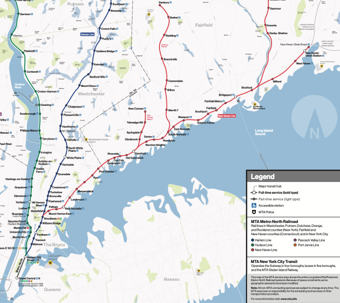
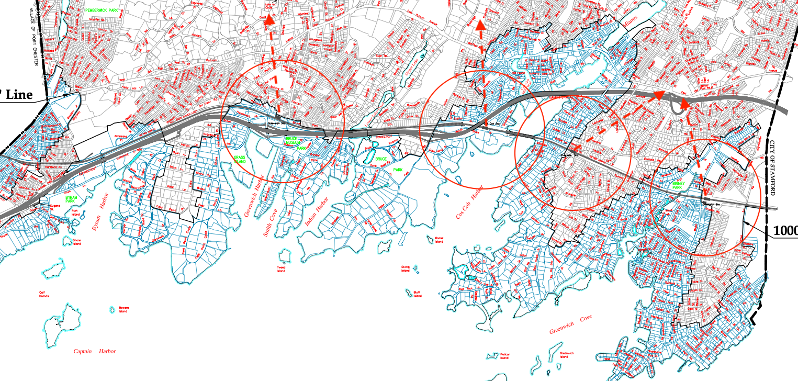

```{r setup, include=FALSE}
library(sf)
library(dplyr)
library(data.table)
library(ggplot2)
library(plotly)
library(DT)
library(skimr)
options(scipen = 999)
```





# Introduction

Connecticut has long had some of the highest income and home prices in the US. Although home prices have trailed national rate of appreciation in recent decades, from a high starting point, housing has gotten a lot more expensive in absolute terms and is still out of reach for too many. High housing costs have constrained population growth in many towns, likely slowed income growth by impeding business formation, and contributed to the State's high costs and taxes. Starting in the 1920's, many CT Towns started requiring large minimum parcel sizes in zoning, among other regulations, often with exclusionary intent, well documented in [On The Line: How Schooling, Housing, and Civil Rights Shaped Hartford and its Suburbs](https://ontheline.trincoll.edu/index.html). The effects of these policies have become acute due to the demand surge caused by the COVID-19 pandemic, which gobbled up residual excess supply left by the Global Financial Crisis. In 2021, a group called [Desegregate CT Work-Live-Ride](https://www.desegregatect.org/work-live-ride) began making a series of reform proposals, a central one being [Bill #6831](https://cga.ct.gov/2025/TOB/H/PDF/2025HB-06831-R00-HB.PDF?mc_cid=91e1b53e90&mc_eid=27bb054ad1) (`WLR`), to allow towns to opt into "Transit Oriented Development" allowing "by right" development of minimum densities and mixed use development near transit stations. This group consists of dozens of housing advocacy groups with backing from the Regional Plan Association (`RPA`), also non-profit whose largest contributors Board Members and often Executive leadership have often come from the New York real estate development industry.

One of the `Desegregate` group's main points has been that only single family homes are allowed as of right on 90% of parcels in the State, while much less commonly for two family housing (and almost not at all more than that). Also, 80% of those single family parcels have been zoned 1+ acres, constraining housing supply growth increasingly over decades and driving up home ownership costs and sprawl. Finally, many towns have allowed only single family residential zoning around vital transit hubs. These points all are unfortunately true, but in my opinion, there is a bait and switch using the valid large lot issue as the reason we need the inflexible `WLR`, when densities near MNR have dramatically lower percentages of residential housing and very few large nearby parcels.

The Connecticut Parcel and Cama data was first added to the Portal after laws requiring it passed in 2021, and offering the opportunity to look at the exact Polygon location data for almost 1.3 million parcels. This made me curious to investigate the lot sizes and housing density in those locations using the [CT Geodata Portal](https://geodata.ct.gov/pages/parcels) and to explore what it all would mean for my Town of Greenwich. There are surely a lot of experts with more knowledge of these issues and stronger views on either side mine. I agree with most of the sentiments of the pro-housing reform coalition, but hope on the eve of the legislative session, this post injects what has seemed absent from the contentious discussions thus far. For full disclosure, I grew up in Stamford and live near a station in Greenwich (but not within a potential transit zone), and probably carry some of those biases against what might be done in a suburban location, but also have yet to see a multi-family residential project in my town which I opposed (likely putting me among the most pro-housing residents in my community). There is a lot of data cleaning and coding in this post, so please feel free to skip ahead to `Results and Analysis` to the tables and charts of findings and parting thoughts.


# Collecting, Loading and Cleaning Data

I downloaded the Parcel File Geodatabase and 2024 CAMA property assessment data for each city. There are also separate files for county layers, but used the 2024 Basic Parcel Layers (including all counties) and filtered for Fairfield County and the last few Towns up the MNR line into New Haven County, the economic engine of the State. I get "unexpected geometry" warnings about interior rings, but discovered that changing to type = 3 while importing, converting the 3-dimensional XYZ Multi-Polygons to 2-dimensional XY Polygons for each parcel, which seems to work for my purposes. In the future, I would like to see if I can also look at the building footprints within the parcels, but this was enough for the purposes of this post. This was my first attempt at using GIS data on this scale, and so my knowledge is superficial, and suggestions are welcome.

<details>

<summary>Load and Clean FF Parcels</summary>

```{r 'ff_parcels', warning=FALSE}
# Basic Parcel Geodatabase 
folder <- "~/Documents/Data/ct_state_data/"
file <- paste0(folder, "2024 Basic Parcel Layer.gdb")

# Reading and filtering for Fairfield County towns
ff_parcels <- read_sf(
  dsn = file, 
  query =
    "SELECT * FROM \"Basic_Parcels_2024\" where Town_Name in ('Greenwich', 'Stamford', 'Darien', 'New Canaan', 'Westport', 'Norwalk', 'Bridgeport', 'Shelton', 'West Haven', 'New Haven', 'East Haven', 'Trumbull', 'Easton', 'Redding', 'Bethel', 'Brookfield', 'Danbury', 'Newtown', 'New Fairfield', 'Ridgefield', 'Wilton', 'Weston', 'Stratford', 'Fairfield', 'Monroe', 'Ridgefield', 'Orange', 'Milford', 'Derby')", 
  type = 3)

# Clean parcels
ff_parcels <- ff_parcels[sf::st_is_valid(ff_parcels),]

# Fix Danbury links
ff_parcels[ff_parcels$Town_Name == "Danbury", ]$CAMA_Link <- 
  paste0("18500-", ff_parcels[ff_parcels$Town_Name =="Danbury", ]$Parcel_ID)
```

</details>


There were several thousand parcels which were invalid, and the only way I could manipulate the data with the `{sf}` package, was by removing them with `sf::st_is_valid()`. Also, Danbury's disclosure was missing all property links, but I was fortunately able to extract and parse from other fields. The polygon shapes can be seen inside the NAD83 Connecticut boundaries. I spent some time trying to convert this to a lon-lat Coordinate Reference System (CRS), but in the end, discovered could do everything I needed with the original CRS distances. Below is the Shape of the parcels, which are I believe are called State Plane Coordinates.


```{r 'show_ff_parcels_shape', echo=TRUE, eval=TRUE}
# Towns along the MRN property Polygons
print(ff_parcels$Shape)
```

The Geodatabase unfortunately does not currently have the property assessment data, including the "state use" codes (ie: Commercial, Residential (Single Family, Multi-family), Industrial), which are the only way I could sort residential properties, and within those, if more than one family would be allowed in a location. The problem with the CAMA data is that was not contributed by Towns with consistent standards (as I have often found with data submitted by 169 often small towns probably lacking data infrastructure). While the data could be a lot cleaner and more uniform, my first recommendation would be to clean up the state use codes, and include them in this GIS database, which would streamline things for those working with the raw data instead of the online Parcel Viewer.

<details>

<summary>Load and Clean CAMA Data</summary>

```{r 'cama'}
file <- paste0(folder, "/2024_Connecticut_Parcel_and_CAMA_Data_20250111.csv")
cama_data <- data.table::fread(file)
cama_data[, link := re2::re2_replace_all(link, " ", "")]
cama_data <- janitor::clean_names(cama_data)

# Fix some Darien links not matching ff_parcels data
cama_data[
    property_city == "Darien"
    , link := data.table::fifelse(
      re2::re2_detect(link, ".*\\-\\d$"), 
      re2::re2_extract_replace(link, "^(.*)\\-(\\d)$", "\\1-0\\2"),
      link
    )]

# Fix missing Bridgeport links
cama_data[
  property_city=="Bridgeport", 
  cama_site_link := paste("0", cama_site_link)]

# Clean up any whitepace to make sure of joins
cama_data[, cama_site_link := trimws(cama_site_link)]
```
</details>

The full extent of the work in progress nature of this data can be seen in the `{skimR}` summary below. Some places where the state might clean up this dataset are: eight towns haven't populated the `town_id` field, and various other fields are incomplete. There are two zoning fields (`zone` and `zone description`), but no uniform structure to these. An academic from Connecticut was Founder of the [National Zoning Atlas](https://www.zoningatlas.org/atlas), an impressive data-oriented project, which led to the initial recognition of the extent of the large lot zoning problem in the State. It doesn't appear that this data can be downloaded and combined with other data, but tying the parcel data to to minimum zoned lot sizes would be big opportunity. The Zoning Atlas data also doesn't include Coastal Overlay or other flood plane data, which seems like a significant factor to zoning for many parcels along the MNR line (if you look at the train map above). 

For now, the most important field for the purposes of this exercise is `state_use` which is never NA, but in four towns had an empty string for all properties and overall has over 1600 unique categories just in this subset of Towns. `state_use` for a single family in most towns is "101", but there are many others coded as simply "100" or starting with "1" followed by other formats. If I had more time, I might be able to do a better job predicting `state_use` with `state_use_description`, but leave that for another time. For this reason, all data summaries below had to be looked at as approximate and by no means the final word on density or mix of land use near stations.


```{r 'summarize_cama', echo=FALSE}
# Summarize
keeps <- c("skim_type", "skim_variable", "n_missing", "complete_rate", "character.empty", "character.n_unique", "character.whitespace")
cama_skim <- data.table::as.data.table(skimr::skim(cama_data))
# Generate pretty names and round numeric values to two digits inside the DT::datatable
DT::datatable(
  cama_skim[, ..keeps, with = TRUE],
  options = list(scrollX = TRUE),
  colnames = c(
    "Type",
    "Variable",
    "Missing",
    "Complete Rate",
    "Empty Strings",
    "Unique Values",
    "Whitespace"
  )
) %>%
  formatRound(columns = c("complete_rate"), digits = 2)
```


In order to get train station coordinates, I found the USDOT Intermodal Passenger Connectivity Dataset (IPCD) with 15,000 transportation hubs around the US. This offers the option to conduct future analyses around other transport hubs, like bus routes. It took a few tries to get the MNR lines, for example, Cos Cob is mistakenly listed in NY state, and some locations came up more than once if there was both an Amtrak, MNR or bus stop at that location. I generally prefer data.table, but this doesn't work for data manipulation with sf objects. I was able to get away with it here using only the X, Y coordinates, and then convert back to sf further downstream.


<details>

<summary>Load Train Station coordinates</summary>

```{r 'load-ipcd'}
file <- 
  paste0(folder, 
  "NTAD_Intermodal_Passenger_Connectivity_Database/Intermodal_Passenger_Connectivity_Database_(IPCD).shp"
  )
trains <- st_read(
  dsn = file, 
  query = "select * from \"Intermodal_Passenger_Connectivity_Database_(IPCD)\" 
    where METRO_AREA LIKE 'Bridgeport-Stamford-Norwalk CT' AND MODE_RAIL = 1")
data.table::setDT(trains)

# Filter unique stations by point_id and select columns
trains <- unique(trains, by="POINT_ID")
trains <- 
  trains[, .(X, Y, POINT_ID, ADDRESS, METRO_AREA, FAC_NAME, CITY, STATE, ZIPCODE)]
```
</details>

```{r 'show_train_stations'}
DT::datatable(trains)
```


# Code for Filtering and Aggregating Parcels within Ranges

This section has the code to load and find lots within progressively expanding radiuses for each station. My custom function, `get_parcels_in_geo_range()`, loads data from an IPCD point and filter CAMA points within a specified parameter distance. Again, I'm relatively new to GIS data, so it took me a long time to figure out how to create the station `{sf}` data.frame in a long-lat point XY dimension and with a CRS which could properly filter the ff_parcels for distance with `st::st_is_within_distance()`. First I had to load as CRS 4326, then transform to 2234 for distance calculations in accordance with my ff_parcels sf formatting. This took a long time to figure out, and I still don't completely understand how it is working.

<details>

<summary>Get Parcels in GEO Range</summary>

```{r 'get_parcels_in_geo_range'}
get_parcels_in_geo_range <- function(point_id, dist_range) {
  
  # Using trains, cama_data, and ff_parcels from the global env
  
  # Get train station
  train_station <- trains[trains$POINT_ID == point_id]
  train_station <- data.frame(lon=train_station$X, lat=train_station$Y)
  
  # Convert to sf
  station <- 
    sf::st_as_sf(train_station, coords = c("lon", "lat"), crs = 4326) %>% 
    st_transform(crs = 2234) 
  
  # Find lots with components within dist_range
  wd <- 
    st_is_within_distance(ff_parcels, station, dist = units::set_units(dist_range, "mile"))

  # Drop any lots where none of the components are within dist_range
  parcels <- ff_parcels %>% filter(lengths(wd) > 0)
  
  # Convert to data.table
  data.table::setDT(parcels)
  
  # Clean names
  parcels <- janitor::clean_names(parcels)
  
  # Keep lots >=0
  parcels <- parcels[shape_area >= 0]
  
  # Copy cama_data to leave in place
  cama_data <- copy(cama_data)
  
  # Clean up any extra spaces in Cama link
  parcels[, cama_link := re2::re2_replace_all(cama_link, " ", "")]
  
  # Join data on "link" = "cama_link"
  parcels <- cama_data[parcels, on = c("link" = "cama_link")]
  
  # Return
  return(parcels)
}
```

</details>

In `prepare_town_data_frame()`, I had to use trial and error to figure out towns where the standard codes were not picking up residential properties. There were varying codes for single family home, condominium or apartment building, so I did my best to capture them all as shown in the `resi_codes` vector below. Unfortunately, I had to leave the job of separating single- and multi-family properties for a later time. I went with number of dwellings, which doesn't distinguish between single and multi-family, but does give an overall sense of density in those zones.

<details>

<summary>Prepare Town data.frame</summary>

```{r 'prepare_town_data_frame'}
prepare_town_data_frame <- function(towns) {
  
  # Remove towns outside FF county without parcels
  towns <- towns[sapply(towns, nrow) > 20]
  
  # Convert list of towns to a single data.table
  towns_df <- rbindlist(towns, fill = TRUE, use.names = TRUE, idcol = "station_name")
  
  # Add an indicator and filter keeping properties thought to be residential derived by trial and error
  resi_codes <- 
    c(800, 801, 802, 803, 805, 899, 100, 101, 102, 103, 122, 104, 105, 108, 109, 172, 1010, 1040, 1110, 1012, 1015, 1050, 1111)
  towns_df[, resi := state_use %in% as.character(resi_codes)]
  towns_df[, resi := fifelse((resi == FALSE & state_use_description == "Residential"), TRUE, resi)]
  towns_df[, resi := fifelse((resi == FALSE & state_use_description == "Commericial"), FALSE, resi)]
  towns_df[is.na(resi), resi := FALSE]
  
  # Drop empty links
  towns_df <- 
    towns_df[!link %in% c("48620-", "77200-", "57600-", "68170-", "86370-", "52980-") ]

  return(towns_df)
}

```

</details>

`prepare_station_summary()` summarizes all towns based on properties which were not identified, total residential properties, mean acres of residential dwellings, total number of properties above 1/2 acre and 1 acre, and the total acres of residential land within the specified distance. I also calculated the percentage of residential land within the total area in the half mile radius, which for most stations was more than half.

<details>

<summary>Prepare Station Summary</summary>

```{r 'prepare_station_summary'}
prepare_station_summary <- function(towns_df) {
  
  # Find unmatched links
  missing <- towns_df[is.na(pid), .(unmatched = .N), station_name]
  
  # Count total resi properties near specified station_name
  total_resi <- towns_df[resi == TRUE, .(total_dwellings = .N), by = station_name]
  
  # Calc mean acres and counts of 1/2 and 1 acre parcels
  ff_summary <- dplyr::distinct(towns_df[resi == TRUE], shape, .keep_all = TRUE)[
    , .(
      avg_acres_dwelling = round(mean(shape_area)/43560, 2), 
      `total_half_ac+` = sum(shape_area>0.5*43560), 
      `total_1_ac+` = sum(shape_area >43560))
    ,  station_name]
  
  # Count total acres and resi acres near specified station_name and dist_range
  resi_land <- dplyr::distinct(towns_df[resi==TRUE], shape, .keep_all = TRUE)[
    , .(resi_ac = sum(shape_area)/43560), station_name]
  total_land <- dplyr::distinct(towns_df, shape, .keep_all = TRUE)[
    , .(total_ac = round(sum(shape_area)/43560, 1)), station_name]
  
  # Aggregate components into final table by station_name
  ff_summary <- merge(ff_summary, total_land, by = "station_name")
  ff_summary <- merge(ff_summary, resi_land, by = "station_name")
  ff_summary <- merge(ff_summary, total_resi, by = "station_name")
  ff_summary <- merge(ff_summary, missing, by = "station_name")
  
  # Round digits
  ff_summary <- ff_summary[
    , pct_resi := round(resi_ac/total_ac, 1)][
      , resi_ac := NULL]
  
  # Return
  return(ff_summary)
}
```

</details>

I wrote `get_stations_summary()` to iterate over all the train stations at a given `dist_range` in the select trains data.frame.

<details>

<summary>Get Stations Summary</summary>

```{r 'get_stations_summary', eval=TRUE, echo=FALSE, cache=TRUE}
get_stations_summary <- function(dist_range) {
  
  # Uses trains data.frame in global env

  # Get towns geo data for each station
  towns <- lapply(unique(trains$POINT_ID), function(point_id)
    get_parcels_in_geo_range(
      point_id,
      dist_range = dist_range
    ))
  
  # Add station name to towns list
  names(towns) <- paste(trains$CITY, "-", trains$ADDRESS)
  
  # Convert to data.frame of all towns
  town_df <- prepare_town_data_frame(towns)
  
  # Make summary table
  ff_summary <- prepare_station_summary(town_df)
}

# Apply get_stations_summary() to distances at 1/2 mile increments out to 3 miles
distances <- seq(0.5, 3, by = 0.5)
station_list <- lapply(distances, get_stations_summary)
names(station_list) <- distances
station_df <-
  rbindlist(station_list,
            fill = TRUE,
            use.names = TRUE,
            idcol = "distance")
```

</details>


# Results and Analysis


```{r, eval=FALSE, echo=FALSE, warning=FALSE, message=FALSE}
station_list <- readRDS("~/Documents/Projects/CT_data/ff_parcels.RDS")
station_df <-
  rbindlist(station_list,
            fill = TRUE,
            use.names = TRUE,
            idcol = "distance")
```


Below is a summary table of stations within 1/2 mile of stations with several showing more or less than the 500 acres (expected in 1/2 mile radius). This is probably because some stations may be close to the water or include significant portions that are highway, so has a smaller area of land which may be developed for any purpose. Others may have a large property (ie: cemeteries, golf clubs, parks and schools) with an address within, but extending outside the radius. Bethel's numbers look off, but it is missing most "state use" codes, so it is difficult to accurately account for what parcel usage. For a sense of the overall accuracy for a particular station, the "Unmatched Properties" column shows how many of the parcels were not classified by a "state use" code and were left out of the calculations. For example, I still have a lot of properties near Darien's 33 West Ave station which are not classified. The proposed legislation has specified 15 to 30 units per acre minimum density as of right within these zones, so demonstrating how significant the change for adopting `WLR` could be for residents of those neighborhoods. Overall, there are no stations with average residential lots greater than 1 acre at any of the 26 stations.


```{r '0.5_miles', echo = FALSE, fig.cap='Summary of Properties within 1/2 mile of stations'}
half_mile <- station_list[["0.5"]]
half_mile[, dwellings_acre := round(total_dwellings/(pct_resi * total_ac), 1)]
DT::datatable(
  half_mile, 
  options = list(
    pageLength = 10,
    lengthMenu = c(5, 10, 20, 50, 100),
    scrollX = TRUE
  ), 
  colnames = c("Station", "Acres per Dwelling", "Num. 1/2 ac +", "Num. 1 ac+", "Total Acres", "Num. Dwellings", "Unmatched Properties", "Pct. Residential", "Dwellings per Acre")
)
```

Looking at density per acre for the portion of the zone including residential `state_use` codes, seven out of 26 stations have averages of more than 1 acre per dwelling in the first mile with more after 1.5 miles, much smaller numbers than the 80% average in the state, but still a lot. All of the lower density stations were much further from Grand Central. I don't know the circumstances at those stations, but it does support the claim that some towns may have allowed sparse density at these valuable locations. Two stations have average lot size well above 1 acre in the first 0.5 miles, but then drop below 1 acre further out. Please hover over the lines to more better discern the station and the density at a given point, or select labels on the right to drill down on any location.


```{r 'average_acres', echo=FALSE, fig.cap='Average acres per dwelling is low around many stations'}
plotly::ggplotly(
  ggplot(
    station_df, aes(distance, avg_acres_dwelling, group = station_name, color=station_name)
  ) + geom_line() + geom_line() +
    labs(
      x = "Distance from Station (miles)", 
      y = "Average Residential Lot (Acres)",
      color = "Station City - Address"
      ) +
  theme_bw()
)
```


The next chart shows the number of 1+ acre lots by mile from stations, showing there are few within 1/2 mile at stations closest to NYC in Greenwich, Stamford and Norwalk for example, but there are lower densities much further up the line. While there are approximately 1,000 1+ acre lots near the 26 MNR stations, there are 10x that at 1.5 miles, and 25x 3 miles further away. Once you get a few miles away from stations, there is a lot more land in some locations, so this is my point that the remedy seems to miss the opportunity to address the concern.


```{r 'average_acre_lots', echo = FALSE, fig.cap='There are not many large parcels near trains at most stations'}
plotly::ggplotly(
  ggplot(
    station_df, aes(
      distance, `total_1_ac+`, 
      group = station_name, 
      color = station_name)
  ) + geom_line() +
    labs(x = "Distance from Station (miles)", 
         y = "Number of 1+ Acre Lots",
         color = "Station City - Address") +
  theme_bw()
)
```


# Perspective on Greenwich Topology and `WLR` Impact

I have done my best to read the revisions of `WLR` Bills over the last few years, it really hard to understand the specifics of what my Town would be signing up for, and I'm not sure I would rely on the framing from either side of the debate. Along with five other towns, Greenwich has a population just above the 60,000 cutoff, above which the minimum "by right" density requirement jumps from 15 to 30 dwellings per acre. It is unclear if areas around all four stations would need to adopt those minimum densities or just a few to qualify, or if there are other formats which could satisfy the requirements. Given that this has been discussed for four years and so little has been clarified (at least to me), I can only assume it has been intentionally left vague or so complicated that nobody really knows. In the maximum four station scenario, and if building at that scale given the environmental constraints (discussed below), it could double the number of Town-wide dwellings (if half of the space around each station could be built upon), a substantial change.

From the perspective of a Greenwich resident, it is an unfortunate that the train line runs through the Southern-most tenth of Town, and that larger lot zoning spreads out to the Merritt Parkway and beyond (3-10 miles away). Adding density closer to the Post Road (just 1 mile from the MNR and 2 miles from the Sound), instead of modestly-zoned neighborhoods near the stations in the "Coastal Overlay Zone" (`COZ`), seems like a possible compromise. Transit zones centered around the 311 Bus stops along the Post Road, which in most cases would be closer to basic needs shopping like grocery stores and a lot more large residential parcels. It is also further from the fragile `COZ`. If my estimates are correct, there are currently less than 100 1+ acre residential lots within 1/2 mile of four stations (almost all of those in the `COZ`). Within one mile North of stations, there are about 400 greater than one acre lots, and 1,200 within two miles. Absent the `WLR` discussion, this seems like a more logical place to add density. Coupled with improved bus service and high quality bike lanes to trains stations, concentrating more density around the Post Road closer to the geometric center where there are larger plots, but still close to the trains, seems more natural than the requirements of `WLR`.

On the map below, significant portions of the transit zones (roughly estimated in the red circles below) around all of the train stations are in the `COZ` (shown in blue lines). The red arrows show possible locations about one mile North of stations closer to the Post Road (faint white along the top of the map). As it is written, `WLR` would be remaking neighborhoods composed entirely of smaller lots (the kind `Desegregate` supporters often say they believe should be legal everywhere), allowing developers to construct 10 unit buildings in between 1/4 acre single family parcels without any input from current owners is going to seem punitive. Bundling small parcels together into viable lots seems likely to be a slow and contentious process. A menu of options, like allowing the zone to be shifted North to the Post Road with bike lanes, combined possibly with "missing middle" changes near the MNR stations, allowing duplex and triplex (where they are not now) possibly with a maximum height, easy approval for ADU's and reduced parking minimums. I still don't understand why the discussion never includes MNR parking lots, which have inefficient parking policies and much more sparsely used since the pandemic. If the Town is going to grow meaningfully, I can't see how it does that without a bridge North into actual large lots.




# Final Thoughts

There seem to be many options, but the same ill-fitting one keeps coming back in each round. I admit that there is strong resistance to building anywhere in Greenwich, and along the Post Road would be no exception, but if the goal is to get momentum behind more housing, which I think is overdue, community buy-in seems important. I'm skeptical that my town could sign on for `WLR` in its current drafting given the points above, but hope this will be the round where the two sides start compromising. If there are points I've got wrong about how `WLR` would work or otherwise, I'm just an observer who reads a lot and looks at numbers, and appreciate being educated and would be happy to edit my blog post.

