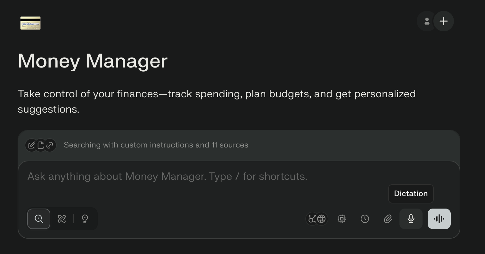

Long ago, I earned the right to call myself a Certified Financial Analyst (CFA), which didn't help that much in advancing my career, but gave me an understanding about how to organize my finances like a professional. One of the core learning elements of the CFA program is the [Investment Policy Statement](https://bit.ly/3JDYOCo) (IPS), something I've kept in head when managing our finances over the last 30 years, but never wrote down. In an afternoon of tinkering with the Perplexity Pro Comet browser, in the pre-formatted "Money Manager" Space, using the Morningstar IPS template without any real manual data entry, I was able to create a high quality document covering all aspects of our finances. With some follow up prompting, I was able to learn more about some of our nuanced issues. It should also be pretty easy to update periodically by giving refreshed data and prompting for an update. Her is a very brief summary of what I did, it should not be considered financial advice and could probably be done much better.

**Perplexity Money Manager**

When I went into Spaces on the left tab, Money Manager and several other pre-formatted example were available.

By clicking on "Searching with custom instructions and 11 sources", there are prompt instructions Perplexity has created for the Space context, which I did not adjust, but might in the future.

>  *You are a personal finance assistant designed to help users manage their money more effectively.*
>
> *Your responsibilities include:*
>
> 1.  *Helping users create and adjust a monthly budget based on income, fixed costs, savings goals, and variable spending.*
> 2.  *Categorizing and summarizing spending patterns (if the user shares transaction data or descriptions).*
> 3.  *Suggesting ways to cut unnecessary expenses and reallocate toward goals (e.g. debt payoff, savings, investing).*
> 4.  *Answering questions about common financial topics like budgeting methods (e.g. 50/30/20 rule), emergency funds, credit scores, and basic investing.*
> 5.  *Offering gentle reminders or check-ins if the user wants recurring support (e.g. "How did I do this week?").*
>
> *When responding:*
>
> -   *Use a clear, supportive, non-judgmental tone.*
> -   *Tailor suggestions to the user's income level, lifestyle, and priorities.*
> -   *Avoid giving investment or tax advice beyond general education.*
>
> *Always treat user privacy and financial information as sensitive.*

Perplexity has also attached some links to sources of financial information, like Nerdwallet and Investopedia to make those available in the context. I initially opened Monarch Money and referred my prompt to that to find my investments, but it was only partially successful, so I would suggest preparing a csv instead or screenshot of your key attributes and attaching to the prompt or adding to the context.

### IPS Creation Steps in Comet Money Manager

-   Enter the "Money Manager" Space in the Comet Browser above
-   Things to attach to prompt or add to the Spaces files context:
    -   your investment holdings as a csv,
    -   a summary of recent income, credits and deductions like a PDF you might have from your tax return (our accountant gives a summary)
    -   a summary of you annual spending categories for example, a PNG of a report from Monarch Money into the prompt or Space Context special instruction files (Perplexity claims to protect personal information, but I made sure there was no social security numbers or bank information)
-   Attach the Morningstar Investment Policy Statement Template (im.morningstar.com/im/InvestPolicyWS.pdf) to the prompt
-   A prompt like: "we are an x year old couple, we plan to work x more years. You can find all our investment holdings, spending, income and tax situation in the attached context documents. We own our home with a 30 year mortage of \\x with 20 years to maturity. Our kids are x years old will go to college will start college at 18 for which we expect to need \$x. Help me to prepare a personal investment policy statement in markdown using the attached Morningstar Investment Policy Statement Template."

**Things It Did for Me**

-   Created the full structure and sections of an IPS in a markdown document
-   Extracted the needed data from the sources to the corresponding fields in the Morningstar IPS template without no manual entry producing a fully detailed IPS with portfolio breakdowns, allocation analysis, and tax efficiency strategies.
-   Extracted xtract the needed annual income, dividends, and tax specifics directly from the tax summary document to calculate after-tax income, tax bracket, and effective savings rate, and add to the template, but this may also take follow ups
-   Perplexity should extract your annual and categorical spending, integrating those numbers as part of the spending and cash flow section of the IPS.

**Possible Fine-Tuning Steps**

-   Perplexity should do it automatically, but you may have to prompt further to properly analyze investment holdings to determine total portfolio values, infer the asset class mix of mutual funds based on fund fact sheets, and calculate allocation percentages (US stock, International stock, bonds, cash and alternatives), automatically populating the details into the IPS template.

I found it did a pretty good job getting most of the investments, but there will surely be fine tuning steps to get the investments correctly categorized. It seemed to miss some funds, and did things like categorizing a global fund as US or leaving out the bonds in a balanced fund. I also nudged it's equity return starting assumption from 8.5% to 6% to be conservative. Another issue I had was to get all the updates to the investments to permiate through the rest of the document. It puts all the investments at the back of the document in an appendix, so once I was happy that the investments were correct amounts and categorized correctly, I had to tell it to redo all the totals and make sure to verify all totals and calculations with Python.

-   
-   Discuss your return expectations by asset class and in aggregate and have it generate your projected future assets and
-   Finalized the IPS by verifying cross-file consistency, correcting errors, and tracking investment and planning milestones, all within the Money Manager platform.
-   Iterate with initial IPS to discuss and add special circumstances like home purchase plans, college, insurance, retirement.

This hands-free process demonstrates how Perplexity Money Manager turns uploaded documents into a comprehensive IPS, leveraging external templates and built-in automation---ideal for users seeking simplicity and accuracy without any repetitive data entry.

