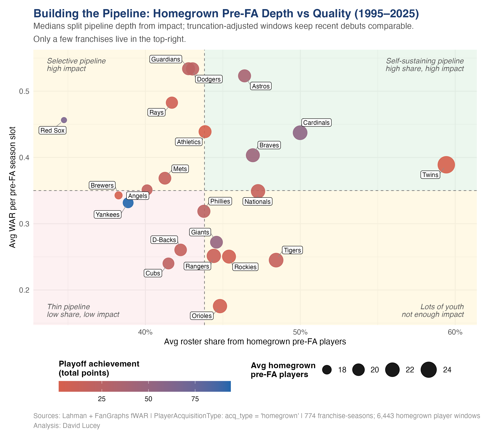
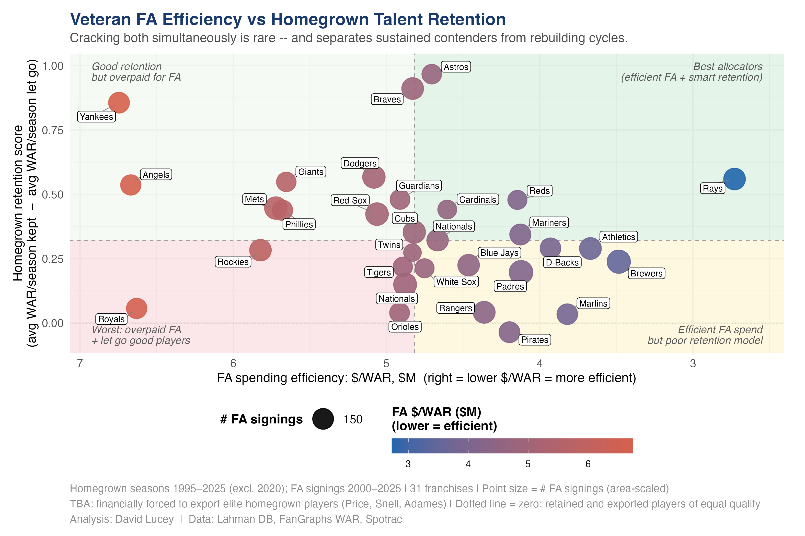
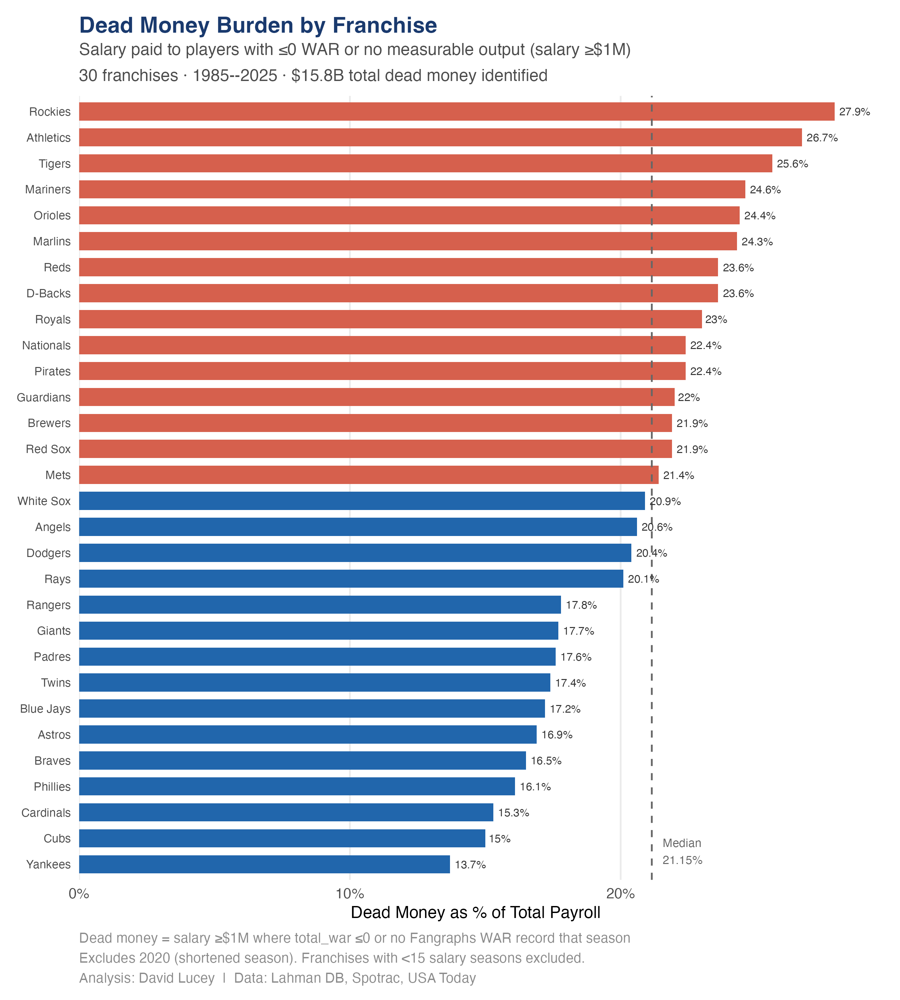
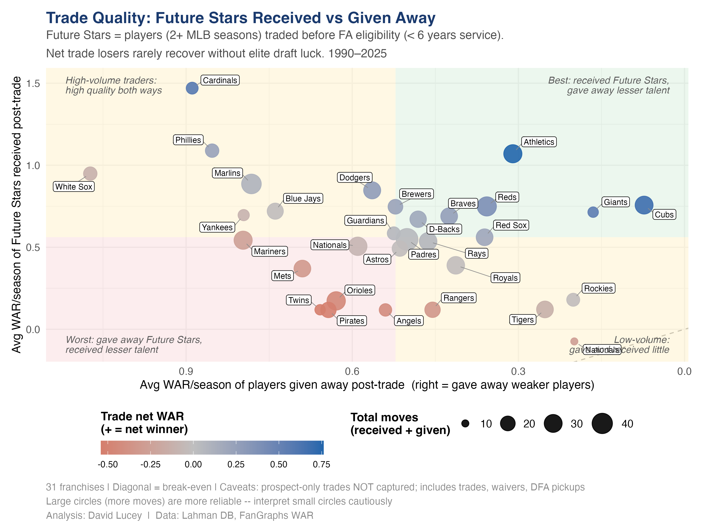
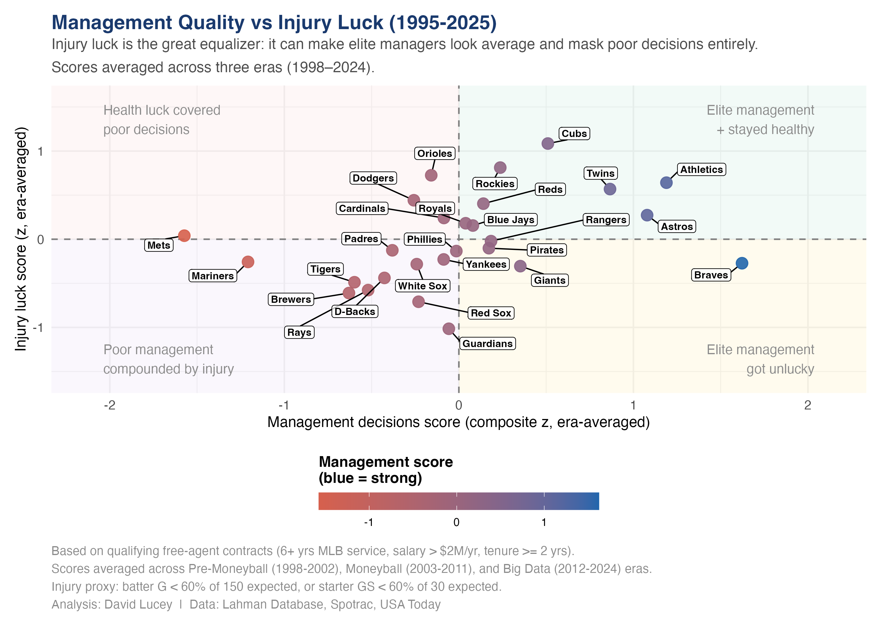
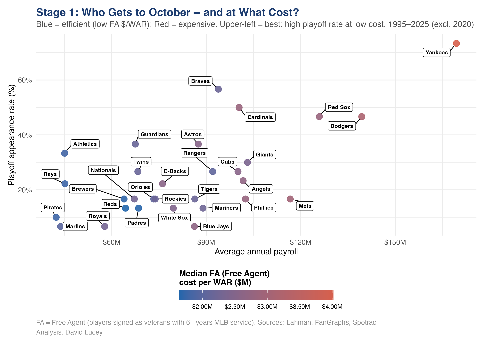
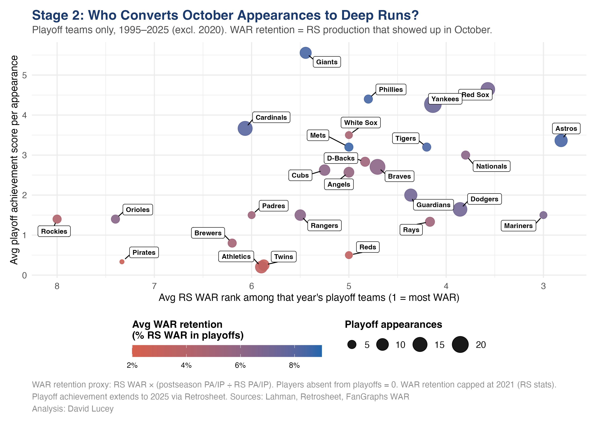
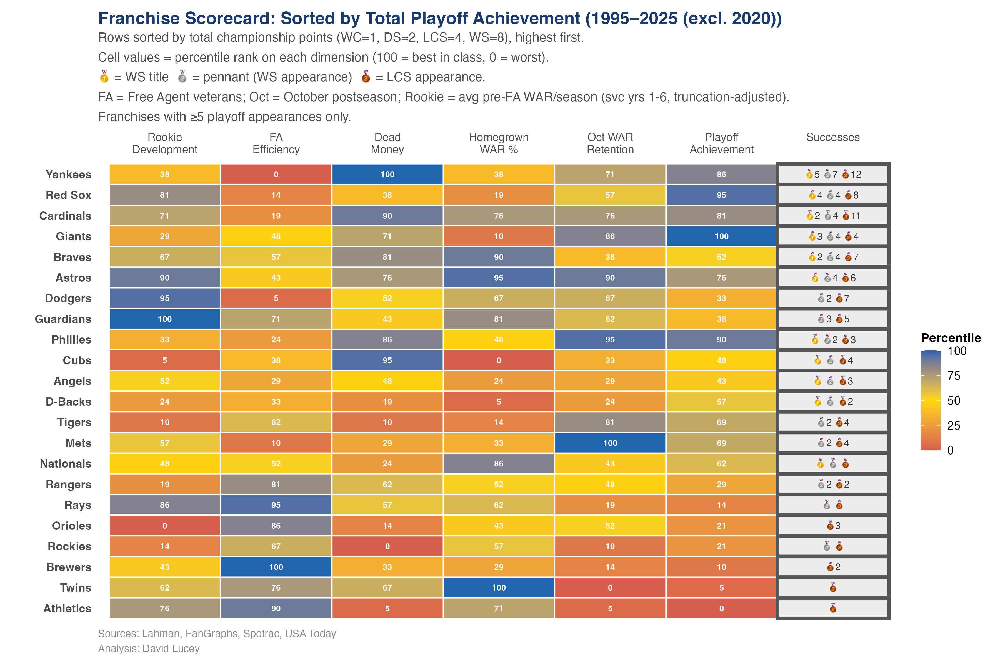
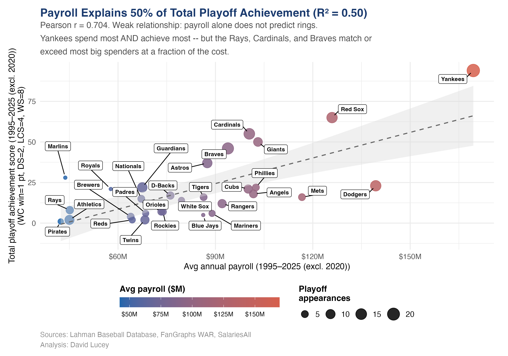

::: {.callout-note}
This article brings the MLB franchise analysis onto the main Redwall Analytics site using the published narrative and chart assets from the standalone [MLB franchise analysis microsite][site]. The full reproducible pipeline still lives in the companion [GitHub repository][repo], where the charts are generated from [`{lahmanTools}`][lahman], DuckDB, and supporting baseball data.
:::

## Using `{lahmanTools}` and the MotherDuck MCP with GitHub Copilot CLI to put analysis on steroids

The [`{lahmanTools}`][lahman] package was created to fill in some of the gaps in the already outstanding [Lahman baseball database](https://sabr.org/lahman-database/), such as WAR and recent salary data, to allow a more complete analysis of franchise management over the period since 1985, where the data is most complete.

The work spans four distinct eras: Early FA (1985-1993), Pre-Moneyball (1994-2002), Moneyball (2003-2011), and Big Data (2012-2025), so future analysis drilling into specific eras may look quite different. The project is structured around a narrative arc of eight acts, each revealing a different dimension of franchise management and its impact on playoff achievement. The final act synthesizes those dimensions into a scorecard that ranks franchises across several management categories.

GitHub Copilot CLI played a major role in building [`{lahmanTools}`][lahman], its DuckDB database, and the charting and Quarto scaffolding used for this project. The ideas, however, were driven by a Mets fan who has learned painfully what management should not do if it wants to win championships.

## Code and reproducibility

The published chart code is available in the source repository:

- [Rebuild all charts][run-all]
- [Shared chart helpers][chart-theme]
- [Narrative site builder][builder]
- [Chart scripts directory][scripts]
- Data/build package: [`lahmanTools`][lahman]

For the standalone presentation version of this work, see [mlbfranchiseanalysis.netlify.app][site].

## Eight things the data reveals

1. Pipeline edge has two parts: rookie quality and rookie roster share, and only a few clubs truly do both.
2. Developing talent and exporting it before free agency pays twice because it absorbs both development and replacement costs.
3. Dead money, salary paid to zero-WAR players, is a tax that hits small markets hardest.
4. Teams that overpay veteran free agents and let homegrown talent walk are paying twice.
5. Payroll mattered over the period (`r = 0.77`, `R^2 ~= 0.60`), but the modern period may be different.
6. Injury luck is real and powerful: some franchises were penalized for decisions they did not make.
7. Making the playoffs efficiently is one problem; going deep in October is another.
8. Champions usually score well across several dimensions, but they do not all win the same way.

## Framework

WAR (Wins Above Replacement) is the common currency of baseball value. It measures how many wins a player adds versus a freely available minor-league call-up.

- WAR 5 = 5 extra wins
- WAR 0 = replaceable
- WAR < 0 = a net drag on the roster

The chain to franchise success outlined in this project is straightforward:

1. Develop rookies into pre-free-agency contributors and fill real roster share internally.
2. Retain the best pre-free-agency talent before they reach the open market.
3. Allocate payroll wisely through efficient free-agent signings and low dead money.
4. Win the trade market for future stars.
5. Survive injury luck, the confounder that cannot be fully controlled.
6. Turn payroll into playoff trips.
7. Carry enough health and depth to go deep in October.

Analytical window: **1995-2025**, excluding 2020. Era labels remain useful context: Early FA (1985-1993), Pre-Moneyball (1994-2002), Moneyball (2003-2011), Big Data (2012-2025).

Data sources: **Lahman DB, FanGraphs fWAR, Spotrac, USA Today, Retrosheet**.

## Act 1: Building the pipeline -- quality vs depth

*Few franchises combine pipeline depth with real impact. Most clubs get one without the other; top-right teams hold the cleanest edge.*

{fig-alt="Quadrant scatter showing rookie pipeline quality versus rookie roster share by franchise."}

This act separates two ideas that often get mashed together: how good homegrown pre-free-agency players are, and how much of the roster a club is actually comfortable filling with them. A deep pipeline without impact is not enough. Elite impact without roster depth is thinner than it looks.

Code: [playoff_efficiency.R][playoff-efficiency]

## Act 2: Keeping stars and paying for performance

*X-axis reversed: right = efficient free-agent spending (lower dollars per WAR). Cracking both free-agent efficiency and homegrown retention is rare.*

{fig-alt="Quadrant scatter showing free-agent efficiency against homegrown retention by franchise."}

This is the two-way allocation problem. Good franchises do not just develop stars; they also avoid replacing cheap value with expensive veteran mistakes. The strongest clubs keep more of what they build and buy the rest efficiently.

Code: [talent_allocation.R][talent-allocation]

## Act 3: Dead money -- the self-inflicted tax on bad contracts

*Dead money = salary of at least $1M paid to players who produced zero or negative WAR. Large markets absorb it. Small markets get crippled by it.*

{fig-alt="Ranked chart of dead money share by franchise."}

Dead money is not just a bad contract metric. It is a budget elasticity metric. The same miss hurts everyone, but it hurts low-payroll franchises far more because one failed long-term deal can swallow a huge share of the roster budget.

Code: [dead_money.R][dead-money]

## Act 4: Who wins the trade market for future stars?

*Future stars = players with at least two post-trade MLB seasons who were moved before free agency. Net losers rarely recover without elite draft luck.*

{fig-alt="Quadrant scatter showing average WAR received versus average WAR given away in trades."}

Trades are where clubs either extend the pipeline or cut it off at the knees. Pipeline builders tend to outperform free-agent-only franchises because they replenish value before it reaches full market price.

Code: [trade_scores.R][trade-scores]

## Act 5: The great confounder -- injury luck

*Scores are era-averaged z-scores. Acts 1-4 are decisions. Act 5 is luck.*

{fig-alt="Quadrant scatter showing market value added and injury-related drag by franchise."}

This is the equalizer. Injuries can make elite decision-makers look average and can temporarily hide weak roster construction. A front office still owns its process, but not every October outcome is a clean referendum on skill.

Code: [gen_mva_full.R][gen-mva-full], [mva_quadrant.R][mva-quadrant]

## Act 6: The payoff -- management decisions convert payroll into October

*Upper-left is best: high playoff rate at low cost. Payroll explains a lot, but efficient franchises still punch above their weight.*

{fig-alt="Scatter showing playoff qualification outcomes relative to payroll and cost efficiency."}

There is no payroll paradox here. Money matters. But it is incomplete. Franchises with sharper rookie pipelines, better retention, cleaner veteran spending, and fewer self-inflicted mistakes get more October from the same dollars.

Code: [playoff_efficiency.R][playoff-efficiency]

## Act 7: Going deep in October

*Making the playoffs is not enough. High WAR retention in October, a proxy for health and usable depth, drives deeper runs.*

{fig-alt="Scatter showing playoff depth versus WAR retention in October."}

Regular-season talent rank is not the same thing as October availability. Teams go deep when the WAR they banked from April through September actually shows up in the postseason.

Code: [playoff_efficiency.R][playoff-efficiency]

## Act 8: The complete scorecard

*Rows sorted by total playoff achievement. Cell values are percentile ranks across the six management dimensions.*

{fig-alt="Full franchise scorecard with percentile ranks across management dimensions."}

The scorecard is the synthesis. No franchise is perfect across every category, but the best long-run organizations avoid obvious holes. Champions usually show multiple strengths, even when the shape of those strengths differs.

Code: [playoff_efficiency.R][playoff-efficiency]

## Appendix: Payroll baseline

*Payroll explains about 60 percent of long-run playoff achievement, which makes front-office edge meaningful rather than magical.*

{fig-alt="Scatter showing payroll rank versus playoff achievement."}

This is the anchor relationship for the whole project. Payroll sets the baseline. Management determines who beats it.

Code: [playoff_efficiency.R][playoff-efficiency]

[site]: https://mlbfranchiseanalysis.netlify.app
[repo]: https://github.com/luceydav/mlb-franchise-analysis
[scripts]: https://github.com/luceydav/mlb-franchise-analysis/tree/main/scripts/linkedin
[run-all]: https://github.com/luceydav/mlb-franchise-analysis/blob/main/scripts/linkedin/run_all.R
[chart-theme]: https://github.com/luceydav/mlb-franchise-analysis/blob/main/scripts/linkedin/chart_theme.R
[builder]: https://github.com/luceydav/mlb-franchise-analysis/blob/main/site/render_site.R
[talent-allocation]: https://github.com/luceydav/mlb-franchise-analysis/blob/main/scripts/linkedin/talent_allocation.R
[dead-money]: https://github.com/luceydav/mlb-franchise-analysis/blob/main/scripts/linkedin/dead_money.R
[trade-scores]: https://github.com/luceydav/mlb-franchise-analysis/blob/main/scripts/linkedin/trade_scores.R
[gen-mva-full]: https://github.com/luceydav/mlb-franchise-analysis/blob/main/scripts/linkedin/gen_mva_full.R
[mva-quadrant]: https://github.com/luceydav/mlb-franchise-analysis/blob/main/scripts/linkedin/mva_quadrant.R
[playoff-efficiency]: https://github.com/luceydav/mlb-franchise-analysis/blob/main/scripts/linkedin/playoff_efficiency.R
[lahman]: https://github.com/luceydav/lahmanTools
